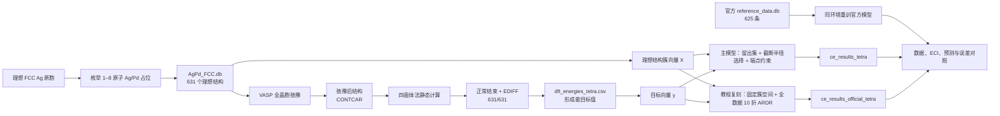

# FCC Ag–Pd 团簇展开：数据集、DFT 计算、模型训练与官方结果对照

> 整理日期：2026-10-09（Asia/Shanghai）  
> 项目目录：`/data2/liudy/ClusterExpansion`  
> 最终 DFT 数据：`dft_energies_tetra.csv`  
> 最终主模型：`ce_results_tetra/agpd_formation_energy.ce`  
> 官方教程协议复刻模型：`ce_results_official_tetra/mixing_energy.ce`

## 1. 结论摘要

本项目已经完成从结构枚举、VASP 弛豫、最终静态能计算、形成能 CSV 生成，到两种 CE 模型训练和官方结果对照的完整流程。

1. 共枚举并计算了 **631 个** FCC Ag–Pd 对称不等价结构，覆盖每个晶胞 1–8 个原子；最终静态计算 **631/631** 正常结束并达到电子收敛。
2. 最终能量采用带 Blöchl 修正的四面体法（`ISMEAR=-5`）。在与官方数据库共同拥有的 623 个合金结构上，最终形成能与官方值的 RMSE 为 **0.6921 meV/atom**，比旧 Methfessel–Paxton 静态能的 **2.5553 meV/atom** 降低 **72.9%**。
3. 最终主模型使用 20% 独立留出集、训练集内 10 折交叉验证、纯 Ag/Pd 端点硬约束，并从三个截断半径候选中选择模型。最终选择 `13.5/6.5/6.0 Å`，训练集 CV RMSE 为 **1.9650 meV/atom**，独立留出 RMSE 为 **2.1237 meV/atom**。
4. 按 ICET 基础教程流程复刻的模型固定使用 `13.5/6.5/6.0 Å`、全部 631 条数据做 10 折 ARDR、无独立留出集、无端点硬约束。其 CV RMSE 为 **1.8709 meV/atom**，82 个参数中 45 个非零。
5. 当前官方教程数据库实际含 **625 条**，而原论文描述的是 **631 条**。在相同软件环境中用官方 625 条数据重训，可复现官方 **44 个非零参数**和 **1.8900 meV/atom** 的 CV RMSE。我们的教程式模型与该官方重训模型的 ECI 相关系数为 **0.999943**，共同结构上的模型预测差 RMSE 为 **0.5711 meV/atom**。

因此，当前 631 个结构不仅足以训练 CE，而且已经给出了与官方结果高度一致、并带独立留出检验的最终模型。后续生产计算应使用 `dft_energies_tetra.csv` 和 `ce_results_tetra/`，不应再使用旧的 `dft_energies.csv` 或历史模型。

## 2. 整体流程



一个关键约定是：**DFT 能量来自弛豫后的晶胞，而 CE 簇向量来自 `AgPd_FCC.db` 中未弛豫的理想 FCC 占位结构。** CE 学习的是固定母晶格上的构型能；局域和晶胞弛豫的能量贡献已经包含在 DFT 目标值中。

## 3. 数据集构成

### 3.1 结构枚举

以晶格常数 `a0=4.09 Å` 的单原子 FCC Ag 原胞为母结构，允许每个晶格位点由 Ag 或 Pd 占据。使用 ICET `enumerate_structures` 枚举 1–8 个原子的超胞，启用 Niggli 约化并使用 `symprec=1e-5` 去除对称等价结构。

| 晶胞原子数 | 结构数 |
|---:|---:|
| 1 | 2 |
| 2 | 2 |
| 3 | 6 |
| 4 | 19 |
| 5 | 28 |
| 6 | 80 |
| 7 | 104 |
| 8 | 390 |
| **合计** | **631** |

数据包含纯 Ag、纯 Pd 两个端点以及 629 个合金结构，共覆盖 23 个不同的 Pd 原子分数。每条结构在 `AgPd_FCC.db` 中保存：

- `enum_index`：连续编号 `0001–0631`；
- `enum_size` / `natoms`：原子数；
- `n_ag`、`n_pd`：元素计数；
- `pd_fraction`：Pd 原子分数；
- 理想 FCC 晶胞和占位信息。

结构枚举与 ASE 数据库写入的关键实现位于：

- `structuregen.py:21–30`：按原子数的预期计数；
- `structuregen.py:69–77`：单原子 FCC 原胞；
- `structuregen.py:87–108`：结构枚举和数据库写入；
- `structuregen.py:136–140`：631 条完整性断言。

### 3.2 与官方结构集的关系

“官方结果”需要区分两个来源：

- [原始论文](https://materialsmodeling.org/assets/publications/AngMunRah19.pdf)描述了至多 8 个原子的 **631 个结构**；
- 当前 [ICET 基础教程](https://icet.materialsmodeling.org/get_started/construct_cluster_expansion.html)所用 `reference_data.db` 实际有 **625 条**。

本项目保存的官方库来自 [ICET 官方仓库固定提交](https://gitlab.com/materials-modeling/icet/-/blob/606063d462d95e1ed516b70124f3e19ed4ce1a25/examples/tutorial/reference_data.db)。由于两套数据库的行号和标签顺序不同，不能按行号直接配对。本项目使用相同 82 维簇向量并四舍五入到小数点后 9 位作为结构指纹，完成一一匹配：

- 官方 625 条全部能在本项目中唯一匹配；
- 本项目另外有 6 个八原子结构：`0375`、`0382`、`0393`、`0394`、`0396`、`0480`；
- 两个数据库内部均未出现簇向量重复。

## 4. DFT 数据生成

### 4.1 K 点、赝势和弛豫输入

每个结构的 K 点网格保持不低于单原子 FCC 原胞 `18×18×18` 的倒空间采样密度。具体做法是计算每个倒易晶格矢量长度与目标间距之比，再逐方向向上取整，使用 Gamma 中心网格。

主要 DFT 设置如下：

| 类别 | 参数 |
|---|---|
| VASP | 6.4.3，19Mar24，build 2024-11-18 |
| 交换关联泛函 | vdW-DF-cx：`GGA=CX`、`AGGAC=0.0`、`LUSE_VDW=.TRUE.`、`LASPH=.TRUE.` |
| 赝势 | `PAW_PBE_64` 标准 Ag/Pd 势 |
| 平面波截断 | `ENCUT=384 eV`，`PREC=Accurate` |
| 电子收敛 | `EDIFF=1e-7`，通常 `ALGO=Normal`、`NELM=200` |
| 弛豫 | `IBRION=2`、`NSW=200`、`ISIF=3`、`EDIFFG=-0.010 eV/Å`、`POTIM=0.20` |
| 弛豫占据 | 一阶 Methfessel–Paxton，`ISMEAR=1`、`SIGMA=0.10 eV` |
| K 点 | 等效或略密于原始 FCC `18×18×18`，Gamma 中心 |

关键代码位置：

- `generate_kpoints.py:31–35`：参考晶格常数和 `18×18×18` 密度；
- `generate_kpoints.py:104–136`：目标间距和逐方向向上取整；
- `generate_relax_incar.py:20–47`：泛函、截断能、收敛、弛豫和展宽参数；
- `generate_relax_potcar.sh`：根据 POSCAR 元素顺序生成 Ag/Pd POTCAR。

631 个结构的弛豫作业 `90924` 全部正常结束，所有结构均通过组成、原子数、晶胞和几何合理性检查。

### 4.2 最终静态能修正

最初的静态计算沿用了 `ISMEAR=1, SIGMA=0.10 eV`。与官方数据比较后发现形成能存在约 `−2.27 meV/atom` 的系统偏差，而论文的最终能量步骤使用带 Blöchl 修正的四面体法。因此重新计算全部结构的最终静态能：

- 从相同弛豫结果复制 `POSCAR`、`POTCAR`、`KPOINTS`；
- 使用 `IBRION=-1`、`NSW=0`；
- 改为 `ISMEAR=-5`；
- 保留 `SIGMA=0.05` 作为论文设置记录；对 `ISMEAR=-5`，VASP 实际不使用展宽；
- 仍使用最后一个 `energy(sigma->0)` 作为总能量。

`prepare_tetra_pilot.py:30–44` 完成 INCAR 的受控替换，`prepare_tetra_all.py:22–70` 验证输入完全一致后为全部结构准备新目录。旧静态结果在新计算全部验证前没有被覆盖。

全量作业 `91081` 进程层面完成 631 个结构，但严格检查发现 `0265`、`0409` 虽正常退出却没有达到 `EDIFF=1e-7`。这两个结构随后在作业 `91093` 中使用 `ALGO=All`、`TIME=0.20`、`NELM=400` 定向重算，最终达到 **631/631 严格收敛**。


在所有结果验证通过后，`finalize_tetra_all.py:88–132` 才将四面体法目录提升为正式 `static/`、重新生成 CSV，并清理旧 MP 静态目录。该迁移已经完成，不应再次执行。

### 4.3 CSV 生成与字段定义

最终 CSV 为 `dft_energies_tetra.csv`，共 631 行数据加一行表头。
CSV 字段为：

| 字段 | 含义 |
|---|---|
| `structure_id` | 四位结构编号 |
| `n_atoms` | 原子数 |
| `n_ag`, `n_pd` | Ag/Pd 原子数 |
| `pd_fraction` | `x_Pd=n_Pd/N` |
| `energy_sigma0_ev` | OUTCAR 最后一个 `energy(sigma->0)` 总能量 |
| `energy_per_atom_ev` | 每原子总能量 |
| `formation_energy_ev_per_atom` | 每原子形成能，即 CE 拟合目标 |
| `volume_per_atom_angstrom3` | 每原子体积 |
| `static_path` | 对应最终静态计算目录 |

对结构 \(s\)，形成能定义为

$$\Delta E_f(s)=\frac{E_s}{N_s}-(1-x_{\mathrm{Pd}})E_{\mathrm{Ag}}^{\mathrm{ref}}-x_{\mathrm{Pd}}E_{\mathrm{Pd}}^{\mathrm{ref}}. $$

这里两个参考能均来自同一批最终静态计算中的纯元素结构。因此纯 Ag 和纯 Pd 的目标值严格为零。对于二元替位合金，这一形成能定义与教程使用的 mixing energy 在数学形式上相同；不同数据集之间仍会因 DFT 细节和各自参考能不同而产生数值差异。


最终 629 个合金结构的形成能统计为：

| 统计量 | meV/atom |
|---|---:|
| 最小值 | −62.9270 |
| 最大值 | −2.8514 |
| 平均值 | −37.1053 |
| 中位数 | −38.7729 |
| 标准差 | 14.7719 |

## 5. CE 模型原理

团簇展开把固定母晶格上的构型能写为团簇函数的线性组合。用矩阵表示为

$$
\boldsymbol y = \mathbf X\boldsymbol J + \boldsymbol\varepsilon,
$$

其中：

- $\boldsymbol y$ 是 631 个 DFT 形成能；
- $\mathbf X$ 的每一行是一个理想占位结构的簇向量；
- $\boldsymbol J$ 是待拟合的有效团簇相互作用参数（ECI）；
- $\boldsymbol\varepsilon$ 包含 DFT 噪声、有限截断和线性模型不能表示的部分。

`ClusterSpace` 根据母晶格、允许元素和不同阶数的截断半径构造常数项、单点、二体、三体和四体簇。最终 `13.5/6.5/6.0 Å` 空间共 82 个参数：

| 阶数 | 含义 | 候选参数数 |
|---:|---|---:|
| 0 | 常数项 | 1 |
| 1 | 单点项 | 1 |
| 2 | 二体 | 25 |
| 3 | 三体 | 20 |
| 4 | 四体 | 35 |
| **合计** |  | **82** |

拟合器采用 ARDR（Automatic Relevance Determination Regression）。它是带逐参数先验精度的贝叶斯线性回归：与数据关系弱的参数会被强烈收缩，从而得到稀疏或近稀疏解；相关参数的保留与系数大小由边际似然优化决定。交叉验证误差用于估计模型对未参与某一折训练的数据的预测能力，而最终模型再使用规定范围内的全部数据训练。

## 6. 最终主模型：`ce_results_tetra/`

### 6.1 训练步骤

主模型由 `train_ce.py` 生成，流程如下：

1. **输入验证**：读取 631 行最终 CSV；要求编号完整、组成与 `AgPd_FCC.db` 一致、目标有限、纯端点为零。
2. **划分独立留出集**：固定纯 Ag/Pd 在训练集；对 629 个合金结构使用 NumPy 随机种子 42 打乱，取 20%，即 126 个结构作为 holdout；其余 503 个合金加两个纯端点，共 505 个训练结构。
3. **构造候选簇空间**：比较 `8.0/5.0/4.0`、`8.0/6.5/6.0` 和 `13.5/6.5/6.0 Å` 三组二体/三体/四体截断。
4. **纯端点约束**：使用 ICET `get_mixing_energy_constraints` 把纯 Ag/Pd 形成能强制为零。82 个原始参数在约束坐标中变成 80 个自由参数。
5. **训练集内模型选择**：每个候选只在 505 个训练结构上做 10 折 ARDR；以 CV RMSE 最小者为最佳簇空间。126 个留出结构不参与截断半径选择。
6. **独立评估**：使用由 505 个结构拟合的模型预测 126 个留出结构，计算 holdout RMSE 和最大绝对误差。
7. **最终重拟合**：确定簇空间后，使用全部 631 个结构重新拟合并写出生产 CE。
8. **输出**：写出模型、指标 JSON 和逐结构预测 CSV。

关键实现位置：

- `train_ce.py:28`：三个默认截断半径候选；
- `train_ce.py:84–146`：CSV/ASE 数据库配对和完整性检查；
- `train_ce.py:149–160`：固定种子、20% 合金留出划分；
- `train_ce.py:163–181`：簇空间、结构容器和设计矩阵；
- `train_ce.py:221–268`：端点约束、10 折 CV 和截断半径选择；
- `train_ce.py:270–275`：独立留出预测；
- `train_ce.py:277–301`：全部 631 条重拟合及端点检查；
- `train_ce.py:303–342`：指标、逐结构预测和模型写出。

注意：`predictions.csv` 中的 holdout 列来自没有见过这些结构的中间模型，而保存的 `.ce` 已经用全部 631 条数据重拟合。`refit_all_rmse` 是保存模型对训练数据的拟合误差，不能代替 holdout 误差。

### 6.2 截断半径选择结果

| 二体/三体/四体截断 (Å) | 参数数 | 自由参数数 | 训练矩阵条件数 | 10 折 CV RMSE (meV/atom) |
|---|---:|---:|---:|---:|
| 8.0 / 5.0 / 4.0 | 12 | 10 | 8.532 | 4.0138 |
| 8.0 / 6.5 / 6.0 | 64 | 62 | 71.370 | 1.9835 |
| **13.5 / 6.5 / 6.0** | **82** | **80** | **83.254** | **1.9650** |

最终模型指标：

| 指标 | 结果 |
|---|---:|
| 总结构数 | 631 |
| 训练 / 独立留出 | 505 / 126 |
| 拟合器 | ARDR |
| 训练集交叉验证 | 10 折，seed 42 |
| CV RMSE | 1.964986 meV/atom |
| holdout RMSE | 2.123721 meV/atom |
| holdout 最大绝对误差 | 8.380734 meV/atom |
| 全数据重拟合 RMSE | 1.660597 meV/atom |
| 纯 Ag / Pd 预测 | 数值精度内 0 / 0 meV/atom |

指标文件报告原始 82 维表示中 82 个数值非零。这个数字受端点约束的坐标变换影响，**不能与无约束教程模型的 ARDR 稀疏参数数直接比较**；可比较的泛化指标是 CV/holdout 误差。

## 7. 官方教程协议复刻模型：`ce_results_official_tetra/`

为把“DFT 数据差异”和“训练协议差异”分开，`train_ce_official.py` 实现了与 ICET 基础教程相同的训练形式：

最终结果为：

| 指标 | 结果 |
|---|---:|
| 结构数 | 631 |
| 总参数 / 非零参数 | 82 / 45 |
| 10 折 CV RMSE | 1.870897 meV/atom |
| 10 折 CV R² | 0.983477 |
| 各折训练 RMSE | 1.614978 meV/atom |
| 最终全数据训练 RMSE | 1.623433 meV/atom |
| 最终训练 R² | 0.988121 |
| 纯 Ag 预测 | +3.510865 meV/atom |
| 纯 Pd 预测 | −2.004429 meV/atom |

端点残差不是错误：教程模型没有强制端点为零，ARDR 会在整体误差与稀疏性之间权衡。若模型要用于形成能、凸包或端点附近热力学，主模型的端点约束更符合物理定义；若目的是逐项复现基础教程，则应使用本节模型。

## 8. 最终数据与官方 DFT 数据对比

以下统计只使用双方共同拥有的 **623 个合金结构**，排除两个按定义为零的纯元素端点，并定义

$$
\Delta E=\Delta E_{\mathrm{本项目}}-\Delta E_{\mathrm{官方}}.
$$

| 数据版本 | 均值偏差 | 中位数偏差 | MAE | RMSE | Pearson 相关系数 |
|---|---:|---:|---:|---:|---:|
| 旧 MP 静态能 | −2.2707 | −2.2401 | 2.2798 | 2.5553 | 0.997327 |
| **最终四面体静态能** | **−0.4237** | **−0.3864** | **0.5328** | **0.6921** | **0.999317** |

单位均为 meV/atom，相关系数无量纲。最终方法把 RMSE 降低了 **72.9%**，并显著减小系统负偏差。这说明将最终静态能从 Methfessel–Paxton 改为四面体法是本次与官方结果对齐的主要改进。

最终差值的范围为 `−3.4946` 到 `+2.1700 meV/atom`。绝对差最大的若干结构为：

| 本项目结构 ID | 本项目 − 官方 (meV/atom) |
|---:|---:|
| 0061 | −3.4946 |
| 0251 | −3.3560 |
| 0149 | −2.7292 |
| 0252 | −2.4113 |
| 0143 | −2.2121 |
| 0247 | +2.1700 |
| 0031 | −2.1422 |
| 0059 | +2.0912 |

本项目弛豫后等效 FCC 晶格常数相对官方值在 625 个共同结构上全部略大，平均差 `+0.002738 Å`，范围 `+0.000269` 至 `+0.005585 Å`。因此剩余约 0.69 meV/atom 的能量差可能来自赝势版本、K 点离散实现、弛豫轨迹和软件细节等；不能仅凭现有对照归因于某一个参数。

最终四面体形成能相对旧 MP 形成能，在 629 个合金结构上平均上移 `+1.8464 meV/atom`，RMSE 差值为 `2.0557 meV/atom`，与旧数据相对官方的负偏差被纠正这一现象一致。

## 9. 最终 CE 与官方 CE 对比

这里同样要区分论文和当前教程的基准。原论文对 631 条数据使用以晶格常数为单位的 `3.3a0/1.6a0/1.5a0` 截断，报告 81 个参数和约 `2 meV/atom` 的 CV RMSE；当前基础教程使用 `13.5/6.5/6.0 Å`、625 条数据库记录，得到 82 个参数、44 个非零参数和 `1.889973 meV/atom` 的 10 折 CV RMSE。本节的逐参数数值对照采用**当前教程基准**，因为它有可下载的固定数据库和可逐项复现的训练代码；论文结果只作量级核对。

### 9.1 三个模型的协议和指标

| 项目 | 官方数据同环境重训 | 本项目教程复刻模型 | 
|---|---:|---:|
| 训练数据 | 官方 625 条 | 本项目最终 631 条 | 
| 截断半径 (Å) | 13.5 / 6.5 / 6.0 | 13.5 / 6.5 / 6.0 | 三组选优，最终同左 |
| 参数数 | 82 | 82 | 82，约束后自由参数 80 |
| 非零参数数 | 44 | 45 | 原始表示 82，不可直接比稀疏性 |
| 交叉验证 | 全部 625 条，10 折 | 全部 631 条，10 折 | 505 个训练结构，10 折 |
| CV RMSE (meV/atom) | 1.889973 | 1.870897 | 1.964986 |
| 最终训练 RMSE (meV/atom) | 1.628285 | 1.623433 | 1.660597 |
| 独立 holdout | 无 | 无 | 126 条，RMSE 2.123721 |
| 纯端点硬约束 | 无 | 无 | 有 |

三列 CV RMSE 不能简单按大小判定模型优劣：前两列在全数据上做交叉验证；主模型的 CV 只在 505 个训练结构内完成，且另有更严格的 126 条独立留出检验。主模型还承担截断半径选择和端点约束，目标与基础教程不完全相同。

### 9.2 分离能量差异与额外 6 个结构的影响

固定使用官方教程的簇空间和 ARDR 协议，可得到：

| 结构集合 | 目标能量 | 非零参数 | CV RMSE | 最终训练 RMSE |
|---|---|---:|---:|---:|
| 官方 625 | 官方能量 | 44 | 1.889973 | 1.628285 |
| 同一官方 625 | 本项目最终四面体能量 | 45 | 1.910326 | 1.621082 |
| 本项目全部 631 | 本项目最终四面体能量 | 45 | 1.870897 | 1.623433 |

单位为 meV/atom。第一行到第二行主要反映 DFT 目标值变化；第二行到第三行同时包含新增 6 个结构以及 10 折重新打乱的影响。因此不能把 `1.9103→1.8709` 全部解释为“增加 6 个结构带来的提升”。

### 9.3 参数和预测的一致性

最公平的参数比较是“本项目教程复刻模型”对“官方数据同环境重训模型”，因为两者簇空间、ARDR 和交叉验证协议一致，仅训练数据不同：

| 对比量 | 结果 |
|---|---:|
| 82 维拟合参数 Pearson 相关系数 | 0.997221 |
| 82 维 ECI Pearson 相关系数 | 0.999943 |
| ECI MAE | 0.038283 meV |
| ECI RMSE | 0.094502 meV |
| ECI 最大绝对差 | 0.606506 meV |
| 非零支持集：本项目 / 官方 | 45 / 44 |
| 支持集交集 / 并集 | 39 / 50 |

按阶数统计的非零参数为：

| 阶数 | 本项目教程复刻 | 官方重训 |
|---:|---:|---:|
| 常数 | 1 | 1 |
| 单点 | 1 | 1 |
| 二体 | 13 | 14 |
| 三体 | 13 | 13 |
| 四体 | 17 | 15 |

ECI 差异最大的条目如下；索引和半径来自完全相同的 82 维簇空间：

| 索引 | 阶数 | 半径 (Å) | 本项目 ECI | 官方 ECI | 差值 |
|---:|---:|---:|---:|---:|---:|
| 1 | 1 | 0.0000 | −37.1753 | −36.5688 | −0.6065 |
| 7 | 2 | 3.5420 | +0.4996 | +0.8194 | −0.3198 |
| 0 | 0 | 0.0000 | −46.3317 | −46.0445 | −0.2871 |
| 3 | 2 | 2.0450 | +4.4346 | +4.7021 | −0.2676 |
| 12 | 2 | 4.5728 | 0.0000 | −0.1509 | +0.1509 |
| 5 | 2 | 2.8921 | +0.3919 | +0.2722 | +0.1197 |
| 72 | 4 | 2.7940 | 0.0000 | +0.0759 | −0.0759 |
| 79 | 4 | 2.9862 | +0.2264 | +0.1515 | +0.0749 |

ECI 单位为 meV。ICET 内部拟合参数与其打印的 ECI 使用簇多重度约定，因此这里比较的是按同一 ICET 定义导出的 ECI，而不是混用原始参数和 ECI。

在双方共同的 623 个合金结构上，两个教程协议模型的预测之差（本项目模型 − 官方模型）为：

| 统计量 | 结果 |
|---|---:|
| 平均差 | −0.415455 meV/atom |
| MAE | 0.480060 meV/atom |
| RMSE | 0.571126 meV/atom |
| 最大绝对差 | 1.605981 meV/atom |
| 预测 Pearson 相关系数 | 0.999649 |

这表明最终四面体数据训练出的教程式 CE 与官方 CE 在参数和预测上都高度一致。剩余差异与第 8 节的 DFT 目标值差异相符。

官方无约束模型对纯 Ag/Pd 的预测分别为 `+4.2099/−1.3299 meV/atom`；本项目教程复刻模型为 `+3.5109/−2.0044 meV/atom`。主模型施加物理端点约束，因此为零。

## 10. 文件、模型和可复现命令

### 10.1 最终文件

| 文件 | 作用 |
|---|---|
| `AgPd_FCC.db` | 631 个理想 FCC 占位结构，是 CE 簇向量来源 |
| `AgPd_DFT/0001–0631/relax/` | VASP 弛豫输入输出 |
| `AgPd_DFT/0001–0631/static/` | 最终四面体法静态输入输出 |
| `dft_energies_tetra.csv` | 631 条最终形成能和体积数据 |
| `ce_results_tetra/agpd_formation_energy.ce` | 带 holdout 和端点约束的最终主模型 |
| `ce_results_tetra/metrics.json` | 主模型选择与误差指标 |
| `ce_results_tetra/predictions.csv` | 主模型逐结构预测及划分 |
| `ce_results_official_tetra/mixing_energy.ce` | 官方教程协议复刻模型 |
| `ce_results_official_tetra/metrics.json` | 教程式模型指标 |
| `ce_results_official_tetra/predictions.csv` | 教程式模型逐结构预测 |
| `official_reference_data.db` | 官方教程 625 条参考数据，用于结构/能量/模型对照 |

`dft_energies.csv` 是旧 MP 静态能的历史文件，仅用于回溯比较，不能再作为生产 CE 的输入。

### 10.2 只读复核

使用与模型训练一致的 Python 环境：

```bash
/home/liudy/.conda/envs/atomate/bin/python collect_dft_data.py \
  --database AgPd_FCC.db \
  --root AgPd_DFT \
  --calculation-subdir static \
  --output /tmp/unused.csv \
  --dry-run
```

当前复核输出为 `Validated static calculations: 631/631`、`Incomplete or invalid: 0`。

### 10.3 在新目录中重现训练

重现主模型，不覆盖现有结果：

```bash
/home/liudy/.conda/envs/atomate/bin/python train_ce.py \
  --data dft_energies_tetra.csv \
  --database AgPd_FCC.db \
  --output-dir ce_results_tetra_reproduced \
  --fit-method ardr \
  --test-fraction 0.20 \
  --cv-folds 10 \
  --seed 42
```

重现官方教程协议模型：

```bash
/home/liudy/.conda/envs/atomate/bin/python train_ce_official.py \
  --data dft_energies_tetra.csv \
  --database AgPd_FCC.db \
  --output-dir ce_results_official_tetra_reproduced
```

`train_ce_official.py` 会拒绝覆盖已有结果，因此输出目录必须是新目录。主模型脚本的三个候选截断半径已写在代码中；上面的命令会按本报告描述自动比较它们。

### 10.4 软件环境

| 软件 | 版本 |
|---|---:|
| Python | 3.10.20 |
| ASE | 3.28.0 |
| ICET | 3.2 |
| trainstation | 1.2 |
| NumPy | 2.2.6 |
| scikit-learn | 1.7.2 |
| VASP | 6.4.3 |


## 11. 使用建议与解释边界

1. **生产用途**：使用 `ce_results_tetra/agpd_formation_energy.ce`。它有独立留出误差、物理端点约束，并在确定簇空间后用全部数据重拟合。
2. **复刻教程或逐项比较 ECI**：使用 `ce_results_official_tetra/mixing_energy.ce`。它与教程协议一致，但没有独立 holdout 和端点约束。
3. **不能用训练 RMSE 代替泛化误差**：主模型应引用 holdout RMSE `2.1237 meV/atom`；教程式模型只能引用 10 折 CV RMSE `1.8709 meV/atom`。
4. **不能直接比较非零参数数**：主模型的端点约束改变了参数坐标，反变换后 82 个参数数值非零不等于 ARDR 没有正则化。
5. **官方 625 与论文 631 要分开表述**：625 是当前教程数据库的实际行数；631 是论文数据集和本项目完整枚举数。
6. **最终 DFT 仍不是逐比特相同的官方计算**：能量已经高度一致，但晶格常数和个别结构仍有小差异。报告的 0.6921 meV/atom 是共同合金结构的 DFT 数据差，不是 CE 的 CV 或 holdout 误差。
7. **下一阶段**：在开展零温凸包或 Monte Carlo 前，建议同时用主模型和教程式模型检查低能结构排序，并重点复核 holdout 最大误差附近以及第 8 节列出的 DFT 差异较大结构。

## 12. 参考来源

- [ICET：Constructing a cluster expansion](https://icet.materialsmodeling.org/get_started/construct_cluster_expansion.html)
- [ICET：Cluster expansions formalism](https://icet.materialsmodeling.org/get_started/cluster_expansions.html)
- [原始方法论文：ICET – A Python library for constructing and sampling alloy cluster expansions](https://materialsmodeling.org/assets/publications/AngMunRah19.pdf)
- [官方教程数据库固定提交](https://gitlab.com/materials-modeling/icet/-/blob/606063d462d95e1ed516b70124f3e19ed4ce1a25/examples/tutorial/reference_data.db)
- 本项目执行历史：`log.md`
- 旧数据与官方基准的历史说明：`official_tutorial_comparison.md`
<!--stackedit_data:
eyJoaXN0b3J5IjpbLTEyMDYxNjI5MjZdfQ==
-->