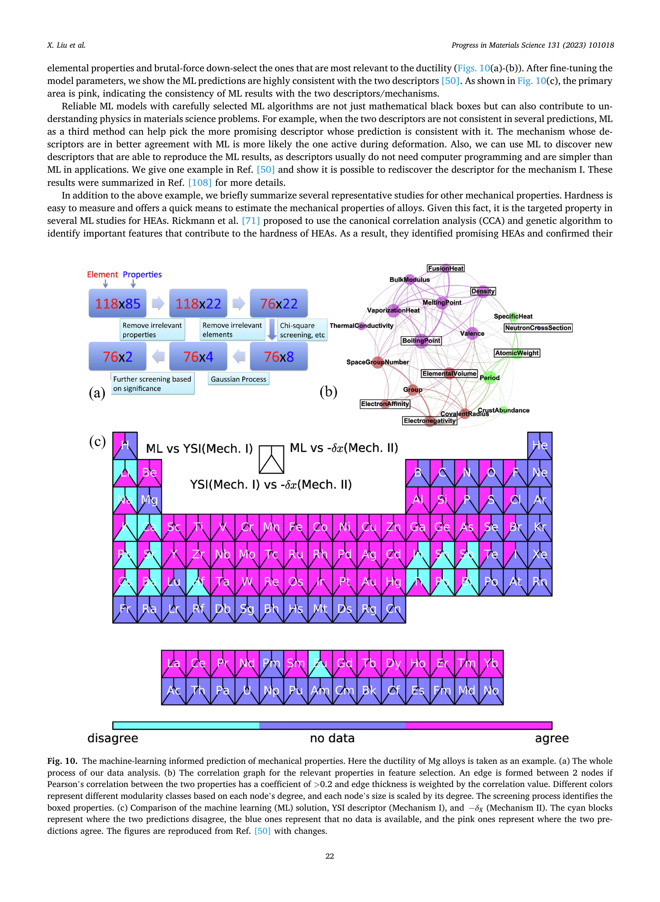

# 文献总结-PbSnTeSe 高熵热电合金的研究：一种 DFT 方法-2022

## 基本信息

- **英文原文标题**: Investigation of PbSnTeSe High-Entropy Thermoelectric Alloy: A DFT Approach
- **DOI**: https://doi.org/10.3390/ma16010235
- **作者**: Ming Xia, Marie-Christine Record, Pascal Boulet
- **期刊**: Materials (MDPI), Volume 16, Issue 1, Article 235
- **ISSN**: 1996-1944
- **投稿日期**: 2022 年 11 月 10 日
- **返修日期**: 2022 年 12 月 19 日
- **接收日期**: 2022 年 12 月 20 日
- **在线发表日期**: 2022 年 12 月 27 日
- **数据/代码链接**: 论文声明 "Data available upon request"（数据可向作者请求获取），未公开开源代码或数据仓库链接。

---

## 详细总结

### 研究背景与动机

热电材料能够直接将废热转化为电能，是解决能源问题的重要候选材料。热电转换效率由无量纲优值 $ZT = S^2\sigma T/\kappa$ 衡量，其中 $S$ 为 Seebeck 系数，$\sigma$ 为电导率，$T$ 为温度，$\kappa$ 为热导率（包含电子和晶格两部分）。由于这些参数之间存在强耦合关系，提升热电效率十分困难。

高熵合金（HEA）作为一种全新的合金化方法，自 2002 年以来已发表超过 11000 篇论文。高熵合金通常定义为含有五种或更多主要元素的单相固溶体，每种元素的摩尔比为 5% 至 35%，由此产生高构型混合熵。由于晶格畸变效应，高熵合金通常具有较低的晶格热导率，这使其成为潜在的热电材料。

此前，Fan 等 [61] 和 Raphel 等 [62,63] 已对 PbSnTeSe 进行了实验研究，但理论研究较为少见。本文首次提出了一种完整的方法，能够获得高熵合金的所有输运系数（包括优值）。

### 研究方法

1. **结构生成**: 使用 ATAT 中的 MCSQS 工具生成含 64 个原子的 2×2×2 超胞特殊准随机结构（SQS），基于 NaCl 型面心立方（FCC）晶体结构。

2. **第一性原理计算**: 在 VASP 中使用投影缀加波（PAW）方法，采用 PBE-GGA 泛函作为交换关联泛函。动能截断能设为 400 eV，几何结构完全弛豫至 Hellmann-Feynman 力小于 0.01 eV/Å。考虑了自旋-轨道耦合（SOC）效应。

3. **电子输运性质**: 使用 BoltzTraP2 代码，基于半经典 Boltzmann 输运理论在弛豫时间近似（RTA）下计算。采用 9×9×9 的密集 k 点网格获取电子能量本征值。弛豫时间通过形变势（DP）理论确定。

4. **晶格热导率**: 采用 Green-Kubo 理论，结合 VASP 中的 on-the-fly 机器学习力场（MLFF）模块。训练使用 512 原子超胞，NVT 系综中时间步长 1 fs；平衡阶段 100 ps；热流计算在 NVE 系综中进行 100 ps，共 10 次独立分子动力学模拟进行系综平均。力场参数由包含 2100 多个结构的数据库构建，Bayesian 误差在原子力、能量和应力方面分别低于 0.006 eV/Å、0.5 meV 和 0.04 kB。

### 主要结果

#### 结构与电子性质
- 优化后的晶格参数：$a$ = 12.74 Å，$b$ = 12.65 Å，$c$ = 12.68 Å，$\alpha$ = 89.8°，$\beta$ = 90.2°，$\gamma$ = 90.6°
- PbSnTeSe 为直接带隙半导体，VBM 和 CBM 均位于 $\Gamma$ 点
- 不考虑 SOC 时带隙为 0.21 eV；考虑 SOC 后带隙降至 0.08 eV，直接带隙略微偏离 $\Gamma$ 点
- SOC 解除了晶体态的简并，产生两个态（$j = l \pm 1/2$）

#### Seebeck 系数与电导率
- Seebeck 系数随载流子浓度先升后降，可用 Mott 公式解释
- 峰值 Seebeck 系数在 160–190 μV/K 范围内，n 型和 p 型差异不大
- n 型弛豫时间（300 K: 158 fs）远大于 p 型（300 K: 17.3 fs）
- n 型电导率始终优于 p 型

#### 功率因子
- p 型峰值 PF: 0.9–1.2 mW/(m·K²)
- n 型峰值 PF: 7–8 mW/(m·K²)
- n 型掺杂在改善热电性能方面比 p 型更有效

#### 电子热导率
- 由 Wiedemann-Franz 定律计算，$k_e = L\sigma T$，Lorenz 数 $L_0 = 2.44 \times 10^{-8}$ W·Ω·K⁻²
- n 型电子热导率大于 p 型

#### 晶格热导率
- 300 K 时 $\kappa_L$ = 0.4 W·K⁻¹·m⁻¹，非常低
- 随温度升高而降低（声子散射增强）
- 低热导率源于高熵合金的晶格畸变效应

#### 优值 ZT
- n 型最佳 ZT ≈ 1.1（500 K）
- p 型最佳 ZT ≈ 0.75（700 K）
- 各温度下 n 型 ZT 均大于 p 型

### 与实验数据对比

与 Fan 等 [61] 和 Raphel 等 [62] 的实验结果对比：
- 实验 ZT（0.45–0.47）低于理论值约两倍
- 理论电导率（15×10⁴ S/m）远高于实验值（2.86×10⁴ S/m），原因：(1) 计算带隙含 SOC 后比实验小三倍；(2) 模型为无缺陷纯化合物，未考虑杂质、缺陷和晶界散射
- 与 GeSnPbSSeTe HEA [85] 和 Sn₀.₂₅Pb₀.₂₅Mn₀.₂₅Ge₀.₂₅Te [87] 等其他高熵合金进行了对比

### 结论

PbSnTeSe 高熵合金是一种有前途的热电材料，具有极低的晶格热导率和令人满意的 ZT 值。n 型掺杂表现优于 p 型，通过进一步与其他元素合金化（特别是提高电导率）仍有改进空间。

---
---

## 摘要翻译

热电材料因能够直接将废热转化为电能而受到广泛关注。作为一种全新的合金化方法，高熵合金（HEA）在材料科学与工程领域引起了极大关注。近期研究发现，高熵合金有可能成为优良的热电（TE）材料。在本研究中，生成了由 64 个原子组成的 PbSnTeSe 高熵合金的特殊准随机结构（SQS）。通过将第一性原理密度泛函理论和 on-the-fly 机器学习的计算与半经典 Boltzmann 输运理论和 Green-Kubo 理论相结合，研究了最高熵 PbSnTeSe 优化结构的热电输运性质。结果表明，PbSnTeSe 高熵合金具有非常低的晶格热导率。对 n 型和 p 型掺杂均评估了电导率、电子热导率和 Seebeck 系数。由于 n 型掺杂具有更大的电导率，n 型 PbSnTeSe 表现出比 p 型 PbSnTeSe 更好的功率因子（$PF = S^2\sigma$）。尽管电子热导率较高，计算得到的 ZT 值仍令人满意。n 型掺杂在 500 K 时获得最大 ZT 值（约 1.1）。这些结果证实 PbSnTeSe 高熵合金是一种有前途的热电材料。

---

## 1. 引言翻译

近年来，能源问题日益严峻。热电材料因能够直接将废热转化为电能而受到广泛关注 [1-4]。优值 $ZT = S^2\sigma T/\kappa$ [5] 用于评价热电转换效率，其中 $S$、$\sigma$、$T$ 和 $\kappa$ 分别为 Seebeck 系数、电导率、温度和热导率（电子和晶格）。然而，由于这些参数之间的强耦合关系，提高热电效率并非易事 [6]。因此，为了提高热电效率，人们探索了各种途径，例如利用能带工程提高功率因子（$S^2\sigma$）[7,8]，以及降低材料的维度以降低晶格热导率 [9-11]。除了用这些策略提高现有材料的热电效率外，寻找新的热电材料也是一种重要途径 [12-14]。

作为一种新兴的合金化方法，高熵合金在材料科学与工程领域引起了广泛关注 [15-20]。从 Chemical Abstract Service/SciFinder 数据库的文献检索表明，自 2002 年以来已发表超过 11000 篇关于高熵合金（HEA）的论文。这些参考文献中的大多数涉及主要含过渡金属元素（Ti、Cr、Fe、Cu、Mo、Co、Ni、Nb、Ta、Pt 等）的材料，偶尔与主族金属或非金属（Al、Si、P 等）组合。这些高熵合金已被研究其力学性能（见参考文献 [21-24]）、催化性能 [25-28]、光催化性能 [29-32] 和耐火性能 [33-36]。迄今为止，已发表超过 350 篇关于高熵合金各种性能的综述 [37-42]。高熵合金通常被定义为具有五种或更多主要元素的单相固溶体，每种元素的摩尔比为 5% 至 35%，由此产生高构型混合熵（$\Delta S_{mix}$），定义为 $\Delta S_{mix} = -R\sum c_i \ln c_i$，其中 $c_i$ 和 $R$ 分别为成分比和气体常数 [15]。通常认为，高混合熵有利于固溶体的形成并减少相的数量 [15]。由于晶格畸变效应 [43] 降低了声子速度并增强了声子散射，高熵合金通常具有较低的晶格热导率 [44-46]。作为高熵硫化物，Cu₅Sn₁.₂MgGeZnS₉ 已被报道在 773 K 时 ZT 值为 0.58 [47]。具有 NaCl 型结构的高熵金属硫族化合物 (Ag,Pb,Bi)(S,Se,Te) 合金已被研究，发现该化合物为 n 型半导体，具有非常低的 $\kappa_L$ 和良好的功率因子，在 723 K 时优值为 0.54 [48]。最近，通过熵驱动结构稳定化形成的 n 型 PbSe 基高熵材料被研究了其热电性能。ZT 值在 900 K 时达到 1.8，这对应于具有良好热电性能的材料 [49]。除高熵合金外，其他更常规类型的化合物也被报道具有低热导率，如 Zintl 相（例如 Ba₂ZnSb₂ [50]）、argyrodite [51]、含硫薄膜 [52]、稀土钼酸盐 [53]、钙钛矿（例如 [54]）和缺陷金属硫族化合物薄膜 [55] 等。通常，这些化合物的热导率低于 1 W/(m·K)。这种低热导率的原因或原因组合已通过密度泛函理论与 Boltzmann 输运理论相结合的方法得到确认。研究揭示了大的 Grüneisen 参数、低位光学和声学声子频率、短声子寿命以及缺陷的存在。我们应当提及，迄今为止，已有数篇论文报道了使用基于从头算分子动力学训练机器学习力场、随后结合 Green-Kubo 形式推导热流和热导率的组合方法来预测材料热导率 [56-58]。这些方法与本工作中使用的方法类似，后者基于 Verdi 等 [59] 的工作。已表明这种机器学习方法非常有效，产生的性能数据接近 Boltzmann 输运理论获得的结果（见例如参考文献 [60]）。

事实是，迄今为止，关于高熵合金热电性能的大部分研究主要是实验研究，高熵合金热电性能的理论研究较为少见。最近，Fan 等 [61] 和 Raphel 等 [62,63] 对 PbSnTeSe 进行了实验研究，他们报道了相当相似的热电性能结果（见下文）。高熵合金输运性质的建模构成了一项挑战，模拟方法及其推导的预测都必须与实验数据进行对比以评估其有效性。在此背景下，本文首次提出了一种完整的方法，能够获得高熵合金的所有输运系数，包括优值。PbSnTeSe 高熵合金的热电输运性质通过结合最先进的方法进行计算，这些方法基于特殊准随机结构方法生成高熵合金结构、第一性原理密度泛函理论（DFT）以及 Boltzmann 输运理论和 Green-Kubo 理论。首先，从 DFT 计算的材料电子态出发，使用线性化 Boltzmann 输运方程计算了电子输运性质（电子电导率、Seebeck 系数和电子热导率），并获得了功率因子。接着，根据 Green-Kubo（GK）理论 [64] 使用 on-the-fly 机器学习力场（MLFF）[65,66] 评估了晶格热导率。最后，确定了 PbSnTeSe 的优值。结果表明 PbSnTeSe 具有非常低的晶格热导率。尽管电子热导率较高，计算得到的 ZT 值仍令人满意。n 型掺杂在 500 K 时获得最大 ZT 值（约 1.1）。这些结果证实了该高熵合金在热电应用方面的价值。

---

## 2. 计算细节翻译

我们的计算在 DFT 框架内进行，使用了投影缀加波（PAW）[67] 技术，如 Vienna Ab Initio Simulation Package（VASP）[68-70] 中所实现。采用广义梯度近似（GGA）[71] 下的 Perdew-Burke-Ernzerhof（PBE）泛函作为交换关联泛函。非经验 PBE 泛函以产生精确的晶体参数和性质而闻名，并且已知满足交换关联空穴的许多求和规则 [72]。通常，在 GGA 泛函失败的地方，局域密度泛函也会失败。关于热导率，与局域密度泛函相比，PBE 不会过度束缚结构（它略微欠束缚），因此原子间力常数不会太软。总体而言，无论使用局域密度还是 GGA 泛函，晶格热导率基本相同 [73]。

高熵合金的特殊准随机结构（SQS）使用合金理论自动化工具包（ATAT）[74] 中实现的 Monte Carlo SQS（MCSQS）工具生成。构建了包含 64 个原子的 2×2×2 超胞用于计算。使用 3×3×3 的 Monkhorst-Pack k 点网格，动能截断能设为 400 eV。几何结构完全弛豫至 Hellmann-Feynman 力小于 0.01 eV/Å。电子输运性质用 BoltzTraP2 代码计算，该代码在弛豫时间近似（RTA）[75] 下实现半经典 Boltzmann 理论。由于输运系数的计算对能带结构精度要求非常高，采用了更密集的 9×9×9 k 点网格来获取电子能量本征值，用于后续电子输运性质计算。由于在 RTA 中电子寿命必须单独确定，这构成了线性化 Boltzmann 输运方程方法的固有局限性，弛豫时间（$\tau$）使用形变势（DP）理论 [76] 确定。由于结构中存在重元素，在计算中考虑了自旋-轨道耦合（SOC）效应。晶格热导率使用 Green-Kubo 理论计算，其中热流从 VASP 的 on-the-fly 机器学习力场 [65,66] 模块获得。使用这种方法的明显优势在于，经典分子动力学能够捕获任意阶的声子动力学，并且适用于可能非常大的结构。困难在于必须获得高质量的原子间参数。MLFF 构建的第一步是通过分子动力学（MD）模拟在 NVT 系综中用机器学习训练力场，其中 N、V 和 T 分别为粒子数、体积和温度，在模拟过程中保持恒定（正则系综）。使用 512 个原子的超胞进行训练，MD 模拟以 1 fs 的时间步长运行。然后，训练完成后，力场用于在 NVT 系综中以 1 fs 的时间步长平衡系统至所需温度，持续 100 ps。最后，通过在 NVE 系综中以 1 fs 的时间步长进行 100 ps 的分子动力学模拟计算热流，其中 N、V 和能量 E 保持恒定（微正则系综）。对于系综平均，执行了 10 次独立分子动力学模拟来计算热流。

力场（FF）的设计在参考文献 [59] 中有详细描述。我们在此给出简要总结。力场参数的拟合依赖于结构数据库（DB）的可用性，拟合质量从能量、原子力和应力张量进行评估。该数据库通过从头算分子动力学（AIMD）模拟 on-the-fly 构建。在 AIMD 的每一步，都会做出决定：是运行新的 AIMD 步骤以向数据库添加新结构，还是用力场运行 MD 步骤。该决定基于从头算原子力与力场原子力之间的估计误差，采用 Bayesian 推断做出。因此，该算法依赖 Bayesian 线性回归来评估力场参数的质量。在我们的情况下，力场参数由包含 2100 多个结构的数据库构建。原子力、能量和应力的 Bayesian 误差分别低于 0.006 eV/Å、0.5 meV 和 0.04 kB。力场参数质量基于力场正确再现二体和三体分布（参考文献 [59] 中的公式 (2) 和 (3)）的能力来评估，这些分布分别表示在给定原子周围某一距离处找到一个原子或某一距离和角度处找到一对原子的可能性。由此，用力场计算的晶格参数与从头算获得的结果相同。

---

## 4. 结论翻译

总之，通过将第一性原理计算和 on-the-fly 机器学习技术与半经典 Boltzmann 输运理论和 Green-Kubo 理论相结合，对 PbSnTeSe 高熵合金的热电输运性质进行了全面研究。详细讨论了 PbSnTeSe 高熵合金的电子和热输运系数。结果表明，PbSnTeSe 具有非常低的晶格热导率，低于 0.4 W·K⁻¹·m⁻¹。研究发现，由于更高的电导率，n 型掺杂的 PF 值始终大于 p 型掺杂。n 型 PbSnTeSe 表现出比 p 型更好的热电性能。n 型掺杂在 500 K 时获得最大 ZT 值（≈1.1）。这些结果证实 PbSnTeSe 高熵合金是一种有前途的热电（TE）材料。

---

## 3. 结果与讨论章节子标题翻译

- 3.1 PbSnTeSe 高熵合金的结构与电子性质
- 3.2 PbSnTeSe 的 Seebeck 系数、电导率和功率因子
- 3.3 PbSnTeSe 的电子热导率
- 3.4 机器学习力场势
- 3.5 PbSnTeSe 的晶格热导率
- 3.6 PbSnTeSe 的优值
- 3.7 与 PbSnTeSe 及其他高熵合金已有数据的对比

---
---

## 图题与表题翻译

### 图 1

PbSnTeSe 晶体结构的示意图 (a) 和 ATAT 生成的 SQS 结构 (b)。

### 图 2

不考虑自旋-轨道耦合（SOC）(a) 和考虑 SOC (b) 计算的 PbSnTeSe 能带结构。

### 图 3

n 型 (a) 和 p 型 (b) PbSnTeSe 在 300 K、500 K 和 700 K 下 Seebeck 系数（$）随载流子浓度的变化关系。

### 表 1

PbSnTeSe 在 300 K、500 K 和 700 K 下的弹性常数 $、形变势 $、有效质量 ^*$ 和弛豫时间 $\tau$。

### 图 4

n 型 (a) 和 p 型 (b) PbSnTeSe 在 300 K、500 K 和 700 K 下电导率（$\sigma$）随载流子浓度的变化关系。

### 图 5

n 型 (a) 和 p 型 (b) PbSnTeSe 在 300 K、500 K 和 700 K 下功率因子（PF）随载流子浓度的变化关系。

### 图 6

n 型 (a) 和 p 型 (b) PbSnTeSe 在 300 K、500 K 和 700 K 下热导率的电子部分（$\kappa_e$）随载流子浓度的变化关系。

### 图 7

MLFF 对训练数据集预测的力 (a)、能量 (b) 和应力张量 (c) 的估计 Bayesian 误差。

### 表 2

MLFF 对训练数据集预测的能量、力和应力张量的均方根误差。

### 图 8

由 GK 理论计算的 300 K 晶格热性质。(a) 用零时刻值归一化的热流自相关函数（HFACF）和 (b) 晶格热导率随相关时间的变化关系（$ = 300 K）。

### 图 9

PbSnTeSe 的晶格热导率随温度的变化关系。

### 图 10

n 型 (a) 和 p 型 (b) PbSnTeSe 在 300 K、500 K 和 700 K 下优值（ZT）随载流子浓度的变化关系。

### 表 3

PbSnTeSe 的实验热电性能（来自参考文献 [61,62]）。Fan 等 [61] 的数据在 700 K、$ = 6×10¹⁹ e/cm³ 条件下，Raphel 等 [62] 的数据在 625 K 条件下。

---

## 5. 用户指定章节翻译

（等待用户指定具体章节后进行翻译。）
