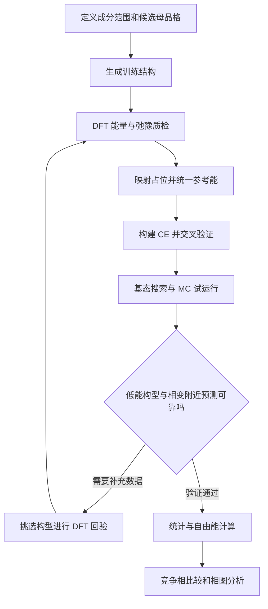

# icet：从团簇展开到高熵合金相稳定性的完整实践教程

**版本：v1.0**  
**官方资料查阅日期：2026-09-20**  
**面向问题：DFT + Cluster Expansion（CE）+ Monte Carlo（MC）研究化学有序、相分离、构型自由能与相稳定性**  
**软件基线：检索时 PyPI 最新发布为 icet 4.0，发布日期 2026-09-05。官方在线文档持续更新，不能假定每个页面与已安装发行版完全一致。**

本文是基于 icet 官网、官方 API、开发团队教程及相关论文编写的中文学习与研究指南，不是官网的逐页翻译。示例分为“官方 Ag–Pd 数据练习”和“需要自行提供 DFT 数据的五元高熵合金模板”。文中给出的晶格常数、截断距离、温度和采样长度，凡未标明为官方数据，均为教学起点，不代表经过收敛验证的材料参数。

配套代码的实际核验范围见第 21 节；本文不包含新计算得到的高熵合金相图或转变温度。

## 目录

1. [icet 能解决什么问题](#chapter-01)
2. [环境、版本与快速入门](#chapter-02)
3. [CE 的物理与数学基础](#chapter-03)
4. [项目结构和数据约定](#chapter-04)
5. [训练结构：枚举、随机、SQS 与主动学习](#chapter-05)
6. [DFT 计算与晶格映射](#chapter-06)
7. [构建和保存 CE 模型](#chapter-07)
8. [验证：从拟合误差到相稳定性可靠性](#chapter-08)
9. [零温基态与凸包](#chapter-09)
10. [MC 系综如何选择](#chapter-10)
11. [正则 MC：固定成分的温度扫描](#chapter-11)
12. [短程有序、长程有序与相分离的区分](#chapter-12)
13. [MC 统计、热容和收敛](#chapter-13)
14. [SGC：化学势扫描与符号自检](#chapter-14)
15. [VCSGC：自由能导数与相图](#chapter-15)
16. [热力学积分：构型熵与自由能](#chapter-16)
17. [扩展到 Nb–Mo–Ta–W–V 高熵合金](#chapter-17)
18. [高级功能与适用边界](#chapter-18)
19. [常见问题与排查](#chapter-19)
20. [研究记录和发表前核查](#chapter-20)
21. [配套代码、练习与本次验证范围](#chapter-21)
22. [官方资料索引与相关文献](#chapter-22)

---

<a id="chapter-01"></a>

## 1. icet 能解决什么问题

icet 的核心任务是：在给定母晶格和允许占位元素的前提下，用有限数量的参考计算建立“原子占位构型到能量”的快速模型。随后用 MC 大量采样，获得热平衡下的构型统计。DFT 提供能量标签，icet 构建 CE，`mchammer` 负责 MC，`trainstation` 提供拟合工具，ASE 负责原子结构与数据接口。[官方首页](https://icet.materialsmodeling.org/)、[工作流程](https://icet.materialsmodeling.org/get_started/workflow.html)

| 研究问题 | 主要方法 | 得到的结果 | 仍需注意的条件 |
|---|---|---|---|
| 固定成分的原子偏好如何随温度变化 | CE + 正则 MC | 能量、SRO、占位统计 | 有限尺寸、平衡性、低温采样困难 |
| 是否出现 B2 等化学有序 | 正则 MC + 长程有序指标 | 有序参数与转变候选温区 | 一个元素对的 SRO 不足以确认完整相结构 |
| 固溶体是否分解 | 成分相关自由能、SGC/VCSGC | 共存成分、分解倾向 | 竞争相、界面与应变影响 |
| 元素数增加是否提高真实构型熵 | MC + 热力学积分 | 构型熵随温度变化 | 不能全温区套用理想混合熵 |
| BCC 是否比 FCC、HCP 或 Laves 稳定 | 多相自由能比较 | 稳定相组合 | 单一 BCC CE 不会自动生成其他母晶格 |
| 扩散多快、团簇多久形成 | 需要动力学模型 | 时间尺度和速率 | 常规平衡 MC 的步数不是物理时间 |

**首先限定你要比较的状态空间。** “BCC 母晶格内的化学有序化”“BCC 固溶体的成分分解”和“所有晶体结构之间的全局稳定性”是三个不同层次的问题。

建议采用以下闭环。图中“DFT 回验”指对 CE 认为重要、但可能缺少训练支持的构型补做第一性原理计算。



<a id="chapter-02"></a>

## 2. 环境、版本与快速入门

### 2.1 安装和版本固定

查阅时官方安装页要求 Python 3.10 或以上。PyPI 提供源码分发包，安装可能需要符合 C++17 的编译器；conda-forge 提供预编译包，但具体平台及版本可用性应由求解器确认。Windows 用户若遇到编译问题，可采用已有的 WSL/Linux 科研环境；这是实践建议，不是说原生 Windows 一定不能安装。[官方安装说明](https://icet.materialsmodeling.org/get_started/installation.html)、[PyPI 版本记录](https://pypi.org/project/icet/)

使用 conda 的示例：

```bash
conda create -n icet-study -c conda-forge python=3.12 icet=4.0 matplotlib
conda activate icet-study
```

若目标平台暂时没有该版本的 conda 包，先核对可用构建，再决定使用源码安装或合适的平台。不要悄悄切换版本后仍把结果标成 4.0。

已有 Python 环境中可创建虚拟环境：

```bash
python -m venv .venv
```

Linux/macOS 激活：

```bash
source .venv/bin/activate
python -m pip install --upgrade pip
python -m pip install "icet==4.0" matplotlib
```

Windows PowerShell 激活：

```powershell
.\.venv\Scripts\Activate.ps1
python -m pip install --upgrade pip
python -m pip install "icet==4.0" matplotlib
```

安装后运行配套 `00_check_environment.py`，打印真实安装版本以及本文使用的接口签名。运行成功后再保存环境：

```bash
python 00_check_environment.py
python -m pip freeze > requirements-lock.txt
```

配套 `requirements.in` 只声明目标依赖，不是本次已经安装成功的环境锁文件。不要把它当作跨平台完全可复现的依赖清单。

### 2.2 先用官方 Ag–Pd 数据跑通

官方入门教程以 FCC Ag–Pd 为例，提供包含数据库和脚本的压缩包。它适合学习数据流，不需要首先为自己的五元合金启动一批 DFT。[官方入门页](https://icet.materialsmodeling.org/get_started/index.html)

```bash
curl -L https://icet.materialsmodeling.org/tutorial.zip -o tutorial.zip
unzip tutorial.zip -d official_tutorial
```

Windows PowerShell：

```powershell
Invoke-WebRequest -Uri 'https://icet.materialsmodeling.org/tutorial.zip' -OutFile 'tutorial.zip'
Expand-Archive -LiteralPath 'tutorial.zip' -DestinationPath 'official_tutorial'
Get-ChildItem -LiteralPath 'official_tutorial' -Recurse -Filter 'reference_data.db'
```

找到实际数据库位置，将路径作为参数传给配套脚本：

```bash
python 01_train.py official_tutorial/reference_data.db --out fit_agpd
```

上述路径只是示例；压缩包内部目录变化时，以解压后实际位置为准。脚本默认使用官方 Ag–Pd 的 `mixing_energy` 字段及数据库第 1 条结构作为母晶格，**不能把这条约定套到任意自建数据库上**。

### 2.3 阅读旧示例时的版本检查

检查三处：导入位置、对象属性名、输出字段。本文用 `trainstation.CrossValidationEstimator`；ECI 表格按当前 API 使用 `ce.to_dataframe()`。旧材料中可能出现不同的属性写法。多元 SRO 本文按当前在线 API 使用 `ShortRangeOrderObserver`，不要把旧二元 observer 名称机械替换进五元程序。[CE API](https://icet.materialsmodeling.org/moduleref/cluster_expansion.html)、[Observer API](https://icet.materialsmodeling.org/moduleref/observers.html)

<a id="chapter-03"></a>

## 3. CE 的物理与数学基础

### 3.1 构型、团簇、轨道

固定母晶格后，构型由各格点的元素身份决定：

$$
\boldsymbol{\sigma}=(\sigma_1,\sigma_2,\ldots,\sigma_N).
$$

团簇是若干格点的集合，可包含一个、两个、三个或更多格点。经母晶格对称操作能够互相转换的团簇归为一个轨道（orbit）。多元体系还需区分格点基函数的组合，同一种几何形状因此可以贡献多个参数。

对于每格点能量，采用：

$$
e(\boldsymbol{\sigma})=\sum_\alpha m_\alpha J_\alpha\Phi_\alpha(\boldsymbol{\sigma}).
$$

$m_\alpha$ 是重数，$J_\alpha$ 是 ECI，$\Phi_\alpha$ 是相应轨道的平均团簇函数。常数项与单点项也包含在展开内。[官方 CE 理论](https://icet.materialsmodeling.org/get_started/cluster_expansions.html)

### 3.2 icet 中参数不等于裸 ECI

把结构的团簇向量记为 $\boldsymbol{\phi}$，icet 拟合使用的参数记为 $\boldsymbol{\theta}$：

$$
e=\boldsymbol{\phi}^{\mathsf T}\boldsymbol{\theta},\qquad
\theta_\alpha=m_\alpha J_\alpha.
$$

因此，`ce.parameters` 中的值已经包含重数。解释相互作用时使用 API 导出的 ECI 表，不要再向预测能量重复乘重数。不同软件或不同基函数约定下，ECI 数值未必能直接比较。[参数约定](https://icet.materialsmodeling.org/moduleref/cluster_expansion.html)

### 3.3 截断参数的实际含义

```python
from ase.build import bulk
from icet import ClusterSpace

primitive = bulk('Nb', 'bcc', a=3.2)  # 教学用固定母晶格
cs = ClusterSpace(
    primitive,
    cutoffs=[5.0, 3.5],
    chemical_symbols=['Nb', 'Mo', 'Ta', 'W', 'V'],
)
print(cs)
```

`cutoffs[0]` 控制二体，`cutoffs[1]` 控制三体，后续依次控制四体等。单位是 Angstrom，限制的是团簇中任意两点之间的最大距离。它不是“前几个近邻”，也不是团簇到几何中心的平均半径。输出表中的 `radius` 与输入 `cutoffs` 不能直接当成同一种量比较。[ClusterSpace API](https://icet.materialsmodeling.org/moduleref/cluster_space.html)、[构建示例](https://icet.materialsmodeling.org/get_started/construct_cluster_expansion.html)

### 3.4 多元 CE 为什么更难

从二元增加到五元，每个格点需要更丰富的占位基函数，团簇装饰组合迅速增加。增加长程二体和高阶团簇都可能显著提高参数数目。此时“更多参数”只有在训练数据能够约束这些参数时才有价值。

拟合可写为 $A\boldsymbol{\theta}\approx\mathbf y$，其中每一行是一个结构的团簇向量。训练集既需要数量，也需要覆盖面。许多非常相似的随机结构可能只增加了行数，未能有效增加信息。第 8 节将用学习曲线、分组验证与低能构型回验处理这一问题。

<a id="chapter-04"></a>

## 4. 项目结构和数据约定

建议把物理输入、模型和 MC 输出分开，并给每次计算保留独立目录：

```text
hea_project/
  input/
    primitive.extxyz
    reference_energies.json
    dataset_manifest.md
    composition.json
  dft/
    ideal_structures/
    relaxed_structures/
    raw_outputs/
  datasets/
    training.db
    external_test.db
  models/
    model_v001.ce
    validation_v001.txt
  mc/
    canonical/
    sgc/
    vcsgc/
  analysis/
    figures/
    phase_boundaries.csv
  scripts/
  requirements-lock.txt
```

### 4.1 必须统一的能量定义

对没有空位且完全占据的置换合金，本教程统一使用 eV/atom 训练；它也等于 eV/site。DFT 总能量先除以原子数，再减去参考能：

$$
\Delta e=\frac{E_{\mathrm{DFT}}}{N}-\sum_i c_i e_i^{\mathrm{ref}}.
$$

如果所有参考元素都取同一母晶格上的状态，通常称为该母晶格的混合能。如果取每种元素各自的基态参考，通常称为形成能。两者都能使用，但必须说明参考，并在跨母晶格比较时统一零点。

以固定成分做正则 MC 时，减去线性成分参考项不会改变构型之间的能量差；做 SGC 时，化学势坐标会随参考能约定平移。因此，不要直接比较使用不同参考能的两个模型的原始化学势数值。

### 4.2 CE 和 MC 的单位关系

`ce.predict(structure)` 的单位继承训练目标。本教程是 eV/site。`ClusterExpansionCalculator` 默认乘以格点数，使 MC 中的 `potential` 和接受判断使用总能量 eV。分析每原子能量时再除以原子数。[Calculator API](https://icet.materialsmodeling.org/moduleref/calculators.html)

| 数据 | 本教程单位 |
|---|---|
| DFT 原始能量 | eV/超胞 |
| 训练目标与 `ce.predict` | eV/site |
| `mc.data_container.data['potential']` | eV/超胞 |
| SGC 元素化学势 | eV/atom |
| 温度 | K |
| Boltzmann 常数 | eV/K |
| 自由能导数 $\partial f/\partial c$ | eV/site |

含空位或固定子晶格时，每实际原子、每活性格点和每总格点不再等价，必须重新审查归一化；本教程主线脚本不处理这一情况。

### 4.3 自建 ASE 数据库的最小字段

数据库结构字段保存已经审核过的理想格点占位，弛豫结构另存；属性字段保存与该构型对应的弛豫后 DFT 能量。

| 字段 | 含义 |
|---|---|
| 原子结构 | 与 CE 母晶格兼容的占位构型 |
| `formation_energy_eV_atom` | 按统一参考计算的每原子形成能 |
| `dft_id` | 可追溯到原始 DFT 输出的编号 |
| `parent_lattice` | 如 bcc、fcc |
| `data` 中的元信息 | 参考能版本、弛豫诊断、磁态、计算参数、数据分组 |

使用 `ase.db.connect(...).write(...)` 写入结构和标量属性。文件名应清楚区分理想结构与弛豫结构；不要靠一个含糊的 `energy` 字段推测单位。

<a id="chapter-05"></a>

## 5. 训练结构：枚举、随机、SQS 与主动学习

### 5.1 枚举小胞

枚举生成给定晶格上对称不等价的占位结构，适合系统覆盖有序候选态。先在二元体系练习：

```python
from ase.build import bulk
from icet.tools import enumerate_structures

primitive = bulk('Ag', 'fcc', a=4.09)
structures = list(enumerate_structures(
    primitive, sizes=range(1, 7), chemical_symbols=['Ag', 'Pd']))
print(len(structures))
```

这里的 `sizes` 是相对于输入晶胞的超胞尺寸因子；使用多原子母胞时不能直接理解为原子数。五元体系的组合空间迅速变大，不建议从一开始就无约束枚举大尺寸超胞。[官方枚举教程](https://ce-tutorials.materialsmodeling.org/part-1/enumeration.html)

### 5.2 精确成分的随机结构

设每种元素目标原子数为 $N_i=Nc_i$。必须同时满足所有 $N_i$ 都是整数。等原子五元体系的总原子数应是 5 的倍数；单原子 BCC 原胞重复 $5\times5\times5$ 得到 125 个格点，能够精确等分。

```python
import numpy as np
from ase.build import bulk

atoms = bulk('Nb', 'bcc', a=3.2).repeat((5, 5, 5))
symbols = [s for s in ['Nb', 'Mo', 'Ta', 'W', 'V'] for _ in range(25)]
np.random.default_rng(42).shuffle(symbols)
atoms.set_chemical_symbols(symbols)
```

独立地对每个格点按概率抽元素只能保证平均成分，不保证单个有限超胞精确等原子比。固定成分模拟应先分配整数原子数，再打乱顺序。

### 5.3 SQS 代表随机固溶体，不代表完整训练集

SQS 的目标是让有限超胞的若干关联函数接近理想随机合金。它可用于获得随机态参考，但无法替代低能有序构型、偏聚构型及跨成分数据。[官方 SQS 教程](https://icet.materialsmodeling.org/advanced_topics/sqs_generation.html)

```python
from icet.tools.structure_generation import generate_sqs_from_supercells

# 接续第 3 节的 primitive 和 cs；60 格点可精确表示五元等原子比。
target = {s: 0.2 for s in ['Nb', 'Mo', 'Ta', 'W', 'V']}
sqs = generate_sqs_from_supercells(
    cluster_space=cs,
    supercells=[primitive.repeat((3, 4, 5))],
    target_concentrations=target,
    n_steps=20000,
)
```

这里的长方体只是生成示例，SQS 搜索的几何形状、关联函数范围和步数都需要检查。搜索中的“温度”是优化控制参数，不能理解为真实材料的热处理温度。

### 5.4 对高熵合金更实用的训练集构成

以下是研究设计建议，不是 icet 自动执行的规则：

- 纯元素及重要二元、三元子体系，为端点和相互作用提供约束。
- 目标成分附近的不同有序程度构型，覆盖无序态、B2 等候选有序态。
- 若研究相分离，增加偏离等原子比的成分以及可能的富元素产物。
- 多种胞形和尺寸，避免单一超胞中的周期相关性主导训练集。
- CE 基态搜索和 MC 发现的低能、异常或模型分歧大的构型。

### 5.5 主动学习闭环

用初始数据训练多个候选 CE；在目标温度、成分和低能搜索区域产生构型；结合模型分歧、能量低与构型多样性挑选下一批 DFT；回填后重新验证。不要只挑“预测不确定性最大”的结构，因为它可能离研究区域很远。也不要把模型间一致误认为模型一定正确。[官方主动学习示例](https://ce-tutorials.materialsmodeling.org/part-1/active-learning.html)、[模型集成](https://icet.materialsmodeling.org/advanced_topics/training_ensemble_of_models.html)

<a id="chapter-06"></a>

## 6. DFT 计算与晶格映射

### 6.1 DFT 一致性优先于拟合技巧

在所有结构中保持可比的交换关联泛函、赝势、截断能、k 点密度、电子展宽与能量读取方式。对 Fe、Co、Cr、Mn、Ni 体系，还需认真处理不同初始磁矩和最终磁态。如果相间能差只有几 meV/atom，而 DFT 设置引入更大的系统偏差，低交叉验证误差也不能修复物理标签。

推荐将输入参数、最终能量、收敛标志、应力、体积及磁矩归档。胞大小不同时，保持合理的 k 点密度，而不是对所有结构机械使用同一个 k 点网格。

### 6.2 在理想占位上拟合弛豫后的能量

通常可以用理想格点的占位作为输入，以对应弛豫结构的能量作为目标，这样局域弛豫的能量影响可被有效吸收到 CE 中。前提是弛豫构型仍可被合理、一一地归属到该母晶格的构型。

官方提供映射工具：

```python
from ase.io import read
from icet.tools import map_structure_to_reference

relaxed = read('relaxed.extxyz')
reference = read('primitive.extxyz')
mapped, mapping_info = map_structure_to_reference(relaxed, reference)
print(mapping_info)
```

当前在线 API 的第二个返回对象为包含映射诊断信息的对象；旧教程可能按字典读取。先查看实际类型与本版本文档，再访问字段。映射成功不等于物理合理：仍需检查原子位移、应变、占位歧义和母晶格是否发生变化。[映射教程](https://icet.materialsmodeling.org/advanced_topics/mapping_structures.html)、[映射 API](https://icet.materialsmodeling.org/moduleref/tools.html)

### 6.3 不应通过放宽容差掩盖结构相变

一个 BCC 构型若弛豫成另一类结构，不宜为了让程序接受它而不断增大 `symprec` 或位置容差。应判断它属于需要单独建模的相，还是训练数据本身有问题。对大尺寸失配体系，局域弛豫与长程弹性效应可能超出短程 CE 的表达能力；第 18 节进一步讨论。

<a id="chapter-07"></a>

## 7. 构建和保存 CE 模型

### 7.1 四个核心对象

| 对象 | 输入 | 用途 |
|---|---|---|
| `ClusterSpace` | 母晶格、元素、截断 | 定义可使用的团簇特征 |
| `StructureContainer` | 团簇空间、结构和目标值 | 组织结构并形成拟合矩阵 |
| `CrossValidationEstimator` | 特征矩阵、目标值、拟合方法 | 交叉验证与最终拟合 |
| `ClusterExpansion` | 团簇空间和参数 | 预测、保存、交给 MC |

下面是自建高熵合金数据的核心示例。它要求数据库中的结构已映射到同一 BCC 参考晶格，目标字段已经归一化为 eV/atom：

```python
from ase.db import connect
from ase.io import read
from icet import ClusterSpace, StructureContainer, ClusterExpansion
from trainstation import CrossValidationEstimator

primitive = read('input/primitive.extxyz')
cs = ClusterSpace(primitive, [5.0, 3.5], ['Nb', 'Mo', 'Ta', 'W', 'V'])
container = StructureContainer(cs)
for row in connect('datasets/training.db').select():
    atoms = row.toatoms()
    cs.assert_structure_compatibility(atoms)
    container.add_structure(
        atoms, user_tag=f'dft_{row.id}',
        properties={'energy': row.formation_energy_eV_atom})

A, y = container.get_fit_data(key='energy')
fit = CrossValidationEstimator((A, y), fit_method='ardr', n_splits=5, seed=42)
fit.validate()
fit.train()
print(fit)
ce = ClusterExpansion(cs, fit.parameters, metadata={'target_units': 'eV/site'})
ce.write('model.ce')
```

此例用于说明接口；固定截断加一次随机交叉验证不是完整的生产验证流程。官方 Ag–Pd 示例采用相同对象链，具体 API 分别见 [StructureContainer](https://icet.materialsmodeling.org/moduleref/structure_container.html) 和 [CrossValidationEstimator](https://trainstation.materialsmodeling.org/moduleref/cross_validation_estimator.html)。

### 7.2 拟合方法如何选择

| 方法 | 适合尝试的情况 | 需要检查 |
|---|---|---|
| Least squares | 参数少且数据充分 | 病态矩阵、噪声放大 |
| Ridge | 参数相关性强，希望平滑正则化 | 正则化强度与验证误差 |
| LASSO / Elastic net | 希望获得较稀疏模型 | 特征缩放、相关特征选择不稳定 |
| ARDR | 希望自动压缩不重要的参数 | 超参数、数据量、低能排序 |
| RFE | 希望系统进行特征筛选 | 计算成本与筛选中的数据泄漏 |

没有对所有高熵合金都最好的拟合方法。至少比较一个稀疏模型与一个平滑正则化模型，并保持相同的数据划分。官方教程提供方法比较与超参数扫描示例。[回归方法](https://ce-tutorials.materialsmodeling.org/part-1/regression-methods.html)、[超参数扫描](https://icet.materialsmodeling.org/advanced_topics/training_hyper_parameter_scans.html)

### 7.3 模型与元数据一起保存

除 `.ce` 外，保存训练数据库版本、参考能、截断、拟合方法、随机种子、数据划分和验证结果。不要仅保存一个无法追溯的参数数组。

当前 API 可导出 ECI 表：

```python
from icet import ClusterExpansion

ce = ClusterExpansion.read('model.ce')
ce.to_dataframe().to_csv('eci_table.csv', index=False)
```

`ce.prune()` 可移除严格为零的参数对应项；若人为设置非零阈值，会改变模型，需要重新评估能量误差和重要热力学结果。[ECI 分析](https://icet.materialsmodeling.org/get_started/analyze_ecis.html)

<a id="chapter-08"></a>

## 8. 验证：从拟合误差到相稳定性可靠性

### 8.1 至少检查四个层面

1. **能量误差**：CV/test RMSE、MAE、最大误差，以及随成分、能量和尺寸的分布。
2. **低能排序**：基态和近凸包候选结构是否预测正确。
3. **目标区域外推**：MC 是否访问训练集几乎没有覆盖的成分或关联函数区域。
4. **热力学稳定性**：更换合理 CE 后，相变候选温度、SRO 与相界是否稳定。

RMSE 定义为：

$$
\mathrm{RMSE}=\sqrt{\frac{1}{n}\sum_{j=1}^n(e_j^{\mathrm{CE}}-e_j^{\mathrm{DFT}})^2}.
$$

一个整体 RMSE 很小的模型仍可能错误排序只差几 meV/atom 的候选相。不存在“低于某个通用 RMSE 就一定适合所有相图”的阈值。

### 8.2 防止训练—验证泄漏

同一个小胞结构的重复胞、轻微变形、重复 DFT 计算，以及来自同一条 MC 轨迹的高度相似帧，应该一起分组。否则随机划分可能让验证集几乎复制训练集。跨成分分组留出还能更直接地检验相分离问题所需的成分泛化能力。

配套训练脚本使用普通五折验证，便于入门；真正用于研究时，应另外构造按结构家族、成分或来源分组的外部测试集。不要反复根据测试集选模型，再继续称它为独立测试集。

### 8.3 截断扫描与学习曲线

先固定数据划分，比较不同二体截断；再检查是否需要三体、四体。记录特征数、非零参数数、CV 误差和计算成本。随后逐步增加训练集，判断验证误差是否继续下降。若只增大训练集但误差停滞，可能是基函数表达能力不足，也可能是 DFT 数据存在不一致。[官方截断选择](https://icet.materialsmodeling.org/advanced_topics/training_cutoffs_selection.html)

### 8.4 对关键物理结论传播模型不确定性

从多组合理拟合模型分别执行相同 MC 协议，将热力学结果之间的离散程度与单条 MC 的统计误差分开报告。模型集成的方差是诊断工具，不等同于严格校准后的可信区间。

<a id="chapter-09"></a>

## 9. 零温基态与凸包

MC 之前先检查模型的零温行为，能更早发现假基态和错误端点。

操作顺序：枚举或搜索候选构型；用 CE 预测能量；建立成分—能量下凸包；挑选凸包上及近凸包候选做 DFT；回填并重新拟合；观察基态集合是否稳定。[官方基态枚举示例](https://icet.materialsmodeling.org/get_started/enumerate_structures.html)

二元凸包位于一条成分轴上；五元体系具有四个独立成分维度，不能把所有构型投到某一个元素含量上再当作完整凸包。

在只包含 BCC 构型的数据中，得到的是“BCC 构型集合内的凸包”。要声称全局基态，必须纳入其他晶体结构的竞争相并使用统一参考能。**零温凸包也不能直接当作有限温度相图。**

<a id="chapter-10"></a>

## 10. MC 系综如何选择

| 系综 | 控制量 | 允许变化 | 常见用途 |
|---|---|---|---|
| 正则 Canonical | 温度、总体成分、格点数 | 元素在格点之间交换 | SRO、有序化、固定成分热容 |
| 半巨正则 SGC | 温度、相对化学势、格点数 | 各元素原子数 | 单相成分响应、寻找共存附近跳变 |
| 方差约束半巨正则 VCSGC | 温度、`phis`、`kappa`、格点数 | 受约束的成分涨落 | 跨越两相区采样自由能导数 |

正则 MC 的常见接受率是：

$$
P_{\mathrm{acc}}=\min\left[1,\exp\left(-\frac{\Delta E}{k_BT}\right)\right].
$$

这里 $\Delta E$ 是超胞总能量变化。一次 `run` 的步数通常表示尝试的 trial moves，不是被接受的次数。本文定义一次 sweep 为 $N$ 次 trial moves；若只有部分格点活跃，需说明使用总格点数还是活跃格点数。[正则 MC 官方教程](https://ce-tutorials.materialsmodeling.org/part-3/canonical-simulations.html)

固定总体成分不妨碍局部成分发生分离：一个足够大的正则超胞可以同时形成富 A 与富 B 区域。但有限尺寸与界面能会影响其行为，单个平均能量点也不能直接给出完整共存相界。

<a id="chapter-11"></a>

## 11. 正则 MC：固定成分的温度扫描

### 11.1 从已验证模型出发

```python
import numpy as np
from icet import ClusterExpansion
from mchammer.calculators import ClusterExpansionCalculator
from mchammer.ensembles import CanonicalEnsemble

ce = ClusterExpansion.read('model.ce')
atoms = ce.primitive_structure.repeat((5, 5, 5))
symbols = [s for s in ['Nb', 'Mo', 'Ta', 'W', 'V'] for _ in range(25)]
np.random.default_rng(42).shuffle(symbols)
atoms.set_chemical_symbols(symbols)
cs = ce.get_cluster_space_copy()
cs.assert_structure_compatibility(atoms)
assert not cs.is_supercell_self_interacting(atoms)

calc = ClusterExpansionCalculator(atoms, ce)
mc = CanonicalEnsemble(
    atoms, calc, temperature=1000, random_seed=42,
    dc_filename='T1000_seed42.dc',
    ensemble_data_write_interval=len(atoms),
    trajectory_write_interval=100*len(atoms),
)
mc.run(500*len(atoms))      # 教学起点：平衡阶段
mc.run(1000*len(atoms))     # 教学起点：生产采样
mc.write_data_container('T1000_seed42.dc')
```

此片段假设模型为单原子 BCC 原胞且恰好有 125 格点。通用处理应像配套脚本一样依据实际格点数检查成分。完整接口见 [MC 入门](https://icet.materialsmodeling.org/get_started/run_monte_carlo.html)。

### 11.2 超胞并非只要“大”就可以

首先排除 CE 相互作用通过周期边界与自身发生不合适的重叠，再做有限尺寸研究。高度倾斜的晶胞不能只比较三个边长；用几何检查方法更可靠。还要检查超胞是否能容纳候选有序周期。例如某种有序态需要偶数周期，奇数尺寸超胞可能人为抑制它。[自相互作用接口](https://icet.materialsmodeling.org/moduleref/cluster_space.html)

### 11.3 独立起点、升温和降温

独立随机起点适合发现路径依赖；逐温继承上一温度的平衡构型可提高效率，但可能保留亚稳态。建议在转变候选区分别用随机态、有序态和分离态初始化，比较升温、降温和独立起点。

配套 `02_canonical.py` 对每个温度采用独立随机起点。它没有自动证明达到平衡，也没有自动完成升降温滞后分析。

### 11.4 数据文件和续算

`.dc` 保存观测数据和用于恢复的状态。独立运行必须使用不同文件名，避免把旧模拟当成新模拟。配套脚本发现输出目录已存在时会报错，要求新建目录。

需要续算时，使用与原模拟一致的模型、系综和参数，依照安装版本的数据容器与系综恢复接口操作，并验证步数连续性、参数一致性和随机状态恢复。不要把“读取旧数据分析”和“准确续接原 MC 状态”混为一谈。[数据容器指南](https://icet.materialsmodeling.org/advanced_topics/data_container.html)

<a id="chapter-12"></a>

## 12. 短程有序、长程有序与相分离的区分

### 12.1 Warren–Cowley SRO

对单一置换子晶格，第 $m$ 个壳层的元素对 SRO 为：

$$
\alpha_{AB}^{(m)}=1-\frac{P_{B|A}^{(m)}}{c_B}.
$$

负值表示相对随机分布，A 周围更偏好出现 B；正值表示 A–B 配对受到抑制。它是相对给定成分的统计量，而不是键能本身。

当前官方提供多元 observer：

```python
from mchammer.observers import ShortRangeOrderObserver

# 接在第 11 节 mc.run 之前。
sro = ShortRangeOrderObserver(
    cs, atoms, radius=3.4, interval=10*len(atoms),
    pairs=[('Mo', 'Ta'), ('V', 'W')],
)
mc.attach_observer(sro)
```

`radius` 控制分析的最大元素对距离；它可以不同于 CE 拟合截断。输出字段形如 `sro_Mo_Ta_1`。省略 `pairs` 可分析允许的异种元素对。五元单子晶格每个壳层可选 10 个异种元素对作为独立集合。[SRO API](https://icet.materialsmodeling.org/moduleref/observers.html#mchammer.observers.ShortRangeOrderObserver)

### 12.2 有限尺寸基线

在有限、固定成分的随机占位中，“从剩余原子中不放回抽取邻居”与独立占位不完全相同。因此随机结构的 SRO 不一定精确为零。对没有自身周期重叠的单子晶格，异种元素对的随机均值有 $-1/(N-1)$ 的有限尺寸偏移。应使用同尺寸、同成分随机构型作为参照，而不是看到微小负值就声称出现了真实有序。

### 12.3 如何确认 B2 有序

B2 可看成 BCC 上两组互穿子晶格的化学占位偏好。仅有某一对元素的第一近邻 SRO 并不足够。应进一步统计两组格点上的元素占比，构造相应长程有序参数，或者检查与有序波矢对应的化学结构因子。

研究自发 A2–B2 转变时，不要预先规定某一元素只能占据某组子晶格，否则无序态的构型空间已经被人为删减。应允许元素自由占据 BCC 格点，再在分析中识别两组子晶格。

### 12.4 如何确认相分离

同时查看较长尺度的成分剖面、局域成分分布、低波矢成分涨落以及不同尺寸下的域结构。如果富元素区随系统尺寸增长并与自由能共存分析相符，才能更有把握讨论宏观分解。平衡 MC 中出现的团簇形貌不自动等同于真实时效动力学过程。

<a id="chapter-13"></a>

## 13. MC 统计、热容和收敛

### 13.1 从 trial step 截取生产数据

```python
from mchammer import DataContainer

dc = DataContainer.read('T1000_seed42.dc')
n = len(dc.structure)
start = 500*n
production = dc.data.loc[dc.data['mctrial'] > start]
print(dc.analyze_data('potential', start=start+1))
```

`start` 指 MC trial step，不是 DataFrame 行号。不同 observer 的记录间隔可能不同，SRO 列可以存在缺失值，平均前需选择实际记录的样本。`analyze_data` 返回均值、标准差、相关长度和考虑相关性的误差估计；相关长度按被分析序列的采样间隔理解。[DataContainer API](https://icet.materialsmodeling.org/moduleref/data_containers.html)

### 13.2 正则系综构型热容

当 Hamiltonian 不显含温度，固定成分、固定晶胞的总能量涨落满足：

$$
c_V^{\mathrm{conf}}=\frac{\langle E^2\rangle-\langle E\rangle^2}{Nk_BT^2}.
$$

若使用每原子能量 $e=E/N$，则为：

$$
c_V^{\mathrm{conf}}=\frac{N\left(\langle e^2\rangle-\langle e\rangle^2\right)}{k_BT^2}.
$$

两个公式的 $N$ 因子不同。漏掉它会使热容的尺寸标度错误。这里得到的是构型贡献，不包括完整的声子、电子或磁热容。也不能直接把这个固定成分公式用于 SGC 中混合了成分涨落的能量序列。

### 13.3 自相关与误差条

连续 MC 样本相关，保存 10000 帧不代表有 10000 个独立样本。对所研究的最慢变量检查时间序列与自相关；能量看似稳定时，有序参数或域尺度仍可能缓慢漂移。

采用分块平均、block bootstrap 或多条独立轨迹估计误差。热容依赖二阶矩，比平均能量更难收敛；给热容做误差条时应重采样整段相关数据，而不是把所有帧当独立观测。[官方 MC 分析教程](https://icet.materialsmodeling.org/get_started/analyze_monte_carlo.html)

### 13.4 最小收敛检查表

| 改变的条件 | 应比较的量 |
|---|---|
| 平衡长度加倍 | 均值、序参量、轨迹漂移 |
| 生产采样加倍 | 均值误差、热容和相关长度 |
| 更换随机种子 | 各独立轨迹的结果一致性 |
| 更换初始状态 | 是否存在迟迟不消失的路径依赖 |
| 增大超胞 | SRO、热容峰、域尺度和相界 |
| 缩小温度或控制参数间隔 | 转变区是否被扫描遗漏 |

热容峰是相变的候选信号。有限尺寸峰位、扫温滞后或一个未平衡构型都不应直接作为精确转变温度。

<a id="chapter-14"></a>

## 14. SGC：化学势扫描与符号自检

### 14.1 明确物理定义

以二元 A–B 为例，定义 $c=N_B/N$，并使用物理化学势差：

$$
\Delta\mu=\mu_B-\mu_A.
$$

半巨正则势中的构型项为 $E-\Delta\mu N_B$，因此增大 $\Delta\mu$ 应当更有利于 B 占位。在稳定单相区：

$$
\frac{\partial f}{\partial c}=\Delta\mu,\qquad f=F/N.
$$

当前 SGC API 给出的相对化学势约定与此一致。官方 2024 配套 Notebook 的背景文字写有负号形式，说明不能脱离其差值定义直接拼接公式。本文固定以上定义，并用理想模型自检实际安装版本。[当前 SGC 源码文档](https://icet.materialsmodeling.org/_modules/mchammer/ensembles/semi_grand_canonical_ensemble.html)、[官方 SGC/VCSGC Notebook](https://ce-tutorials.materialsmodeling.org/part-3/sgc-vcsgc-simulations.html)

### 14.2 设置 SGC

```python
from mchammer.ensembles import SemiGrandCanonicalEnsemble

# atoms 和 calc 须来自一个 Ag-Pd CE；不能直接复用五元模型。
mc_sgc = SemiGrandCanonicalEnsemble(
    atoms, calc, temperature=800,
    chemical_potentials={'Ag': 0.0, 'Pd': 0.1},
    random_seed=42,
)
```

每个独立模拟创建新的 calculator。新版 calculator 保存构型状态，不应让多个同时运行的 ensemble 共用同一实例。

在五元单子晶格体系中，固定一个元素的化学势为零作为参考，再指定其余四个元素的相对值；把所有元素化学势同时加上同一个常数不改变采样分布。

### 14.3 用零能量 CE 检查符号

令所有构型能量为零，则占位统计只由化学势和组合熵决定：

$$
c_B=\frac{1}{1+\exp[-\Delta\mu/(k_BT)]}.
$$

配套 `06_check_sgc_sign.py` 构建全部参数为零的二元 CE，比较负、零、正化学势差下的采样成分与此解析式。这个测试是检查软件约定和脚本单位，**不是在计算真实 Ag–Pd 热力学**。

若观测趋势相反，先核对差值定义、传入字典与实现；若数值偏差大，检查采样长度和输出字段。不要通过随手给曲线乘负号来“修复”真实材料结果。

### 14.4 为什么 SGC 不容易连续覆盖两相区

在两相共存附近，同一化学势差可以对应不同成分。有限超胞常表现为成分跳变、亚稳分支和扫描滞后。应记录相变前后构型，并通过两方向扫描、充分采样和尺寸检查确认。

不能把跨越跳变的两个平均成分点直接线性连起来，然后当成连续的均匀相自由能导数。想在两相区获得受控成分统计，可使用 VCSGC。[SGC 官方说明](https://icet.materialsmodeling.org/_modules/mchammer/ensembles/semi_grand_canonical_ensemble.html)

<a id="chapter-15"></a>

## 15. VCSGC：自由能导数与相图

### 15.1 方差约束的含义

VCSGC 对成分涨落施加二次偏置，使模拟能在普通 SGC 难以稳定采样的成分区间内工作。二元形式可用一个正的能量惩罚说明：

$$
E_{\mathrm{bias}}=Nk_BT\kappa\left(c+\frac{\phi}{2}\right)^2.
$$

其统计权重为 $\exp[-(E+E_{\mathrm{bias}})/(k_BT)]$。较大的 $\kappa$ 抑制成分涨落，而不是增强偏离目标值的涨落。本文使用的自由能导数关系为：

$$
\frac{\partial f}{\partial c}=-k_BT\kappa\left(2\langle c\rangle+\phi\right).
$$

这与官方教程的导数表达式一致。查阅时 API 页中部分概率表达式的二次项显示正号，与其“抑制方差”的文字及导数关系不相容；本文因此明确给出正惩罚对应的负指数约定，不照搬该处符号。实际工作仍应检查本地实现及理想极限。[VCSGC API](https://icet.materialsmodeling.org/moduleref/ensembles.html#mchammer.ensembles.VCSGCEnsemble)、[官方教程](https://ce-tutorials.materialsmodeling.org/part-3/sgc-vcsgc-simulations.html)

### 15.2 二元运行示例

```python
from mchammer.calculators import ClusterExpansionCalculator
from mchammer.ensembles import VCSGCEnsemble

# 假定 atoms 与 ce 已按 Ag-Pd 二元体系建立。
calc_vcsgc = ClusterExpansionCalculator(atoms, ce)
mc_vcsgc = VCSGCEnsemble(
    atoms, calc_vcsgc, temperature=800,
    phis={'Pd': -1.0}, kappa=200,
    random_seed=42,
)
mc_vcsgc.run(1000*len(atoms))
```

只为二元中的一个元素设置 `phi`。多元时，每个含 $M$ 种可占位元素的活性子晶格需要 $M-1$ 个 `phi`。不能把五元问题当成只变动一个 `phi` 就覆盖全部成分空间。[VCSGC 参数与检查逻辑](https://icet.materialsmodeling.org/_modules/mchammer/ensembles/vcsgc_ensemble.html)

对于足够强的约束，$c$ 往往接近 $-\phi/2$，但两者不严格相等。扫描约从 `-2.1` 到 `0.1` 可作为二元起点，成分实际覆盖和边界饱和情况需要用结果确认。`kappa=200` 是常见示例值，仍需检查不同约束强度下导数的一致性和采样效率。

### 15.3 从导数恢复自由能

每个控制参数点先完成平衡与统计，获得 $\langle c\rangle$ 和 $\partial f/\partial c$。按实际平均成分排序后积分：

$$
f(c)-f(c_0)=\int_{c_0}^{c}\frac{\partial f}{\partial c'}\,dc'.
$$

不要按 `phi` 直接积分，因为积分变量是成分。近端点可能出现多个控制参数映射到几乎同一成分，需检查饱和点和统计噪声后处理；配套脚本会拒绝重复成分，避免静默积分错误。

配套 `05_integrate_free_energy.py` 只把第一采样点的自由能设为零，生成相对曲线。这足够展示积分，但不同温度或不同晶格的曲线不能各自任意置零后直接比较。必须补上共同的自由能参考。

### 15.4 公切线和相共存

对需要比较的相自由能分支，二元共存成分 $c_\alpha,c_\beta$ 满足：

$$
f_\alpha'(c_\alpha)=f_\beta'(c_\beta)
=\frac{f_\beta(c_\beta)-f_\alpha(c_\alpha)}{c_\beta-c_\alpha}.
$$

若总体成分为 $c_0$，两相体量按原子分数计的比例满足杠杆定则：

$$
\lambda_\alpha=\frac{c_\beta-c_0}{c_\beta-c_\alpha},\qquad
\lambda_\beta=1-\lambda_\alpha.
$$

在多个温度重复采样和共存分析，才能形成温度—成分相界。绘图时应区别测得采样点、插值曲线、统计误差和最终相界。

### 15.5 有限超胞曲线不等于均匀相自由能分支

允许相分离的 VCSGC 超胞在两相区通常含界面。它得到的是相应有限系统的受控成分自由能信息，可能带有界面、形貌和相干应变贡献。不能直接把曲线的每个弯曲都解释成均匀相的化学不稳定性。

二元均匀分支满足 $f''(c)<0$ 时为化学失稳区；这是 spinodal 判据。它不同于公切线给出的 binodal。多元均匀体系应检查独立成分坐标上的 Hessian，而不是只检查某一条任意截线的曲率。实际应用需先确认自由能分支的定义及约束条件。[VCSGC 方法论文](https://doi.org/10.1103/PhysRevB.86.134204)

<a id="chapter-16"></a>

## 16. 热力学积分：构型熵与自由能

### 16.1 不能全温区使用理想混合熵

独立随机占位的热力学极限为：

$$
s_{\mathrm{ideal}}=-k_B\sum_i c_i\ln c_i.
$$

等原子五元时为 $k_B\ln5$。有序化或成分关联会改变真实构型熵，因此用某个 DFT/SQS 能量直接减去 $Ts_{\mathrm{ideal}}$ 不能普遍替代 CE+MC 自由能计算。高熵合金中这一差别可参考构型熵专门研究。[Nataraj 等，2021](https://doi.org/10.1007/s11669-021-00879-9)

### 16.2 温度积分的基本关系

对不显含温度的 Hamiltonian，固定成分下：

$$
\frac{d(f/T)}{dT}=-\frac{u(T)}{T^2},
$$

因而：

$$
\frac{f(T)}{T}=\frac{f(T_0)}{T_0}-\int_{T_0}^{T}\frac{u(T')}{T'^2}\,dT'.
$$

$u(T)=\langle E\rangle/N$。这说明仅有能量随温度的曲线还不够，必须有一个已知的自由能参考 $f(T_0)$。[官方 TI/温度积分教程](https://icet.materialsmodeling.org/advanced_topics/free_energy_canonical_ensemble.html)

另一种适合说明高温参考的写法使用 $\beta=1/(k_BT)$：

$$
\beta f(\beta)=-\frac{\ln\Omega}{N}+\int_0^\beta u(\beta')\,d\beta',
\qquad \Omega=\frac{N!}{\prod_i N_i!}.
$$

这是固定有限原子数的占位构型数。大尺寸时 $(\ln\Omega)/N$ 趋近 $-\sum_i c_i\ln c_i$。使用有限超胞时可保留阶乘修正；数值上用对数阶乘或 `lgamma` 避免溢出。

由此得到：

$$
s(T)=\frac{u(T)-f(T)}{T}.
$$

### 16.3 实践中的积分误差来源

- 高温参考还不够接近随机极限，或者忽略了从无限温到参考温度的修正。
- 温度点过稀，跨过相变区域时积分分辨率不足。
- 低温轨迹未平衡，能量沿错误的亚稳分支变化。
- 不同温度使用不同但没有校正的能量参考。
- 将有限尺寸数据当作已经达到热力学极限。

提高温度或耦合参数网格密度、比较积分路径、采用独立参考，并传播 MC 与 CE 两类不确定性。若 CE 参数本身显含温度，简单能量涨落和温度积分关系需包含相应的温度导数项。

### 16.4 耦合参数积分

构造 $H_\lambda=(1-\lambda)H_0+\lambda H_1$，可写：

$$
F_1-F_0=\int_0^1\left\langle H_1-H_0\right\rangle_\lambda\,d\lambda.
$$

路径上的系综需能充分平衡。若跨越明显势垒，单向快速切换会有非平衡偏差，需要更多中间点、更长平衡以及正反方向检查。官方提供相应 TI 功能，但调用类本身不等于已经获得可靠绝对自由能。

<a id="chapter-17"></a>

## 17. 扩展到 Nb–Mo–Ta–W–V 高熵合金

### 17.1 第一阶段：限定一个可回答的问题

建议起步问题是：“等原子比 NbMoTaWV 在 BCC 母晶格内，主要元素对的 SRO 随温度如何演变，是否出现可辨认的长程化学有序？”

这个问题要求可靠的等原子比附近模型，但尚不要求覆盖所有五元成分及全部晶体结构。研究计划应明确这一范围，避免把结果标题写成“完整相稳定性预测”。

### 17.2 五元体系中的特别检查

| 环节 | 针对五元体系的处理 |
|---|---|
| 元素与参考 | 固定 Nb、Mo、Ta、W、V 的参考能表并归档 |
| 母晶格 | 单原子 BCC 原胞；明确体积与弛豫协议 |
| 成分覆盖 | 等原子比及附近，必要时扩展子体系和分解成分 |
| 特征复杂度 | 从二体和较短三体起步，按验证表现增加 |
| MC 原子数 | 总数能精确容纳五元比例并满足候选有序周期 |
| SRO | 至少检查 10 个异种元素对及多个近邻壳层 |
| 磁性 | 对该难熔体系与磁性 3d 合金使用不同物理假设 |
| 物理结论 | 分清局域化学偏好、长程有序和宏观分解 |

### 17.3 从固定成分走向相分解

若发现某些元素明显聚集，下一步应围绕可能分解方向扩展训练成分，并进行多元化学势或约束成分采样。五元体系有四个独立成分坐标，完整自由能是高维函数：

$$
f=f(T,c_1,c_2,c_3,c_4),\qquad c_5=1-\sum_{i=1}^4c_i.
$$

其微分为：

$$
df=\sum_{i=1}^4(\mu_i-\mu_5)\,dc_i.
$$

沿一条成分路径积分只能得到该路径上的信息。除非有额外约束和验证，不能据此断言所有其他分解方向稳定。多元相共存涉及公共切平面、各相化学势一致和总体质量守恒。

### 17.4 三种可以逐步交付的研究结果

1. **固定成分热力学**：能量、10 组 SRO、长程有序指标和误差条。
2. **BCC 内稳定性**：若干有物理依据的成分截面、候选共存组成及尺寸检查。
3. **跨晶格稳定性**：加入其他结构相的自由能，在同一参考和热力学条件下比较。

这样可以让每一步结果都具有清晰的证据边界。相关 HEA 应用可对照多元 CE/SRO 论文与 CrMoNbV 相图研究；这些论文用于方法与研究设计参考，不表示它们都使用 icet。[Fernández-Caballero 等，2017](https://doi.org/10.1007/s11669-017-0582-3)、[Zhu 等，2023](https://doi.org/10.1016/j.actamat.2023.119062)

<a id="chapter-18"></a>

## 18. 高级功能与适用边界

### 18.1 子晶格与固定格点

`chemical_symbols` 可以按母胞中每个格点分别给出允许元素。它适用于有固定骨架、多个混合子晶格或间隙占位的问题。限制占位集合会改变物理状态空间；使用前先判断这些约束是真实化学约束，还是为了得到预期有序态而人为添加的限制。[子晶格接口](https://icet.materialsmodeling.org/moduleref/cluster_space.html)

### 18.2 约束、加权和 Bayesian CE

可以对端点或可信关系施加约束，也可给关键低能结构更高权重；加权后的整体 RMSE 应与原始未加权误差分开报告。Bayesian 方法允许通过先验表达某些相互作用的关系，但先验也需要物理依据与验证。[约束与权重](https://icet.materialsmodeling.org/advanced_topics/training_with_constraints.html)、[Bayesian CE](https://icet.materialsmodeling.org/advanced_topics/training_bayesian_cluster_expansions.html)

### 18.3 低对称体系与轨道合并

表面、界面或纳米结构的低对称性会增加独立轨道数。轨道合并可以减少模型维度，但相当于增加相互作用相同的假设，不能只为让拟合变简单而随意合并。官方低对称教程更适合在掌握块体 CE 后阅读。[自定义团簇空间](https://icet.materialsmodeling.org/advanced_topics/customizing_cluster_spaces.html)

### 18.4 相干应变

短程 CE 不会自动准确描述长程相干应变。官方 constituent strain 模块提供额外应变项的框架，需要用户另行建立材料相关输入。官方页面特别说明该模块只在 FCC 晶体上测试过，因此不宜直接视为五元 BCC 高熵合金的即用解决方案。[应变模块](https://icet.materialsmodeling.org/advanced_topics/constituent_strain.html)

### 18.5 Hybrid ensemble

可在不同子晶格或允许元素集合上组合不同试探操作，例如一部分保持成分、一部分允许翻转。组合操作必须与所希望采样的约束一致；它并不自动解决慢扩散或动力学时间标定问题。[Hybrid ensembles](https://icet.materialsmodeling.org/advanced_topics/hybrid_ensembles.html)

### 18.6 Wang–Landau

Wang–Landau 通过估计态密度连接能量空间采样和温度相关热力学。需要检查能量分箱、平坦性判据、修改因子和不同能窗之间的拼接。官方以模型体系讲解；对高维多元体系应先评估采样和状态空间规模。[Wang–Landau 教程](https://icet.materialsmodeling.org/advanced_topics/wang_landau_simulations.html)

### 18.7 并行计算

最容易管理的并行维度是独立温度点、独立控制参数点、独立种子和不同 CE。每个进程拥有独立 calculator 和输出文件。Python 多进程脚本使用 `if __name__ == '__main__':` 保护入口，尤其是在 Windows 上。

独立 MC 并行不等于 replica exchange。若需要副本交换，必须明确交换接受概率和实现，不能把多个温度各自运行称为交换采样。[官方并行示例](https://icet.materialsmodeling.org/advanced_topics/parallel_monte_carlo.html)

### 18.8 振动、磁性、电子与压力

常规静态 CE+占位 MC 主要给出模型内的构型自由能。跨晶格、接近磁转变或存在显著声子差异时，可能还需考虑振动、磁、电子贡献及体积/压力条件。不要把“吸收了零温弛豫能”理解成“自动包含了有限温声子熵”。

固定体积的自由能与定压 Gibbs 自由能也不是同一对象。需要在共同的热力学条件下比较，或通过体积相关模型进行相应处理。

<a id="chapter-19"></a>

## 19. 常见问题与排查

| 表现 | 优先排查 | 处理方向 |
|---|---|---|
| pip 安装编译失败 | C++17 编译环境与 Python 版本 | 检查官方要求，考虑匹配的 conda 构建或 Linux 环境 |
| 官网代码属性不存在 | 文档与本地版本不一致 | 运行环境检查，核对 `help`/接口签名 |
| 结构不兼容 | 晶格、胞形、坐标、允许元素 | 正确映射并检查是否发生结构转变 |
| 特征数非常大 | 元素数、高阶团簇、过长截断 | 从简单模型开始并做截断选择 |
| 训练误差小，验证误差大 | 过拟合、数据覆盖不足 | 正则化、分组验证、增加有信息的数据 |
| 验证很好却出现离谱基态 | 数据泄漏或低能区域外推 | DFT 回验预测基态并重训 |
| MC 有自相互作用警告 | 超胞尺度与团簇截断不匹配 | 增大超胞，重新检查几何 |
| 正则 MC 几乎不接受 | 低温势垒、元素配置或单位错误 | 检查能量尺度、初态和更充分采样 |
| 相变温度随尺寸大幅变化 | 有限尺寸或有序周期不相容 | 多尺寸与周期匹配检查 |
| 热容随原子数异常放大/缩小 | 每原子与总能量混淆 | 重查涨落公式中的 $N$ |
| 随机小胞 SRO 不为零 | 固定成分有限尺寸偏移 | 与同尺寸随机基线比较 |
| 五元 SRO 缺少某些列 | pair 筛选、缺失元素、壳层设置 | 检查 observer 设置及结构实际成分 |
| SGC 成分方向与预期相反 | 化学势差定义或版本约定 | 运行零 Hamiltonian 符号自检 |
| SGC 无法得到连续成分曲线 | 两相区及亚稳态 | 使用 VCSGC 或其他合适自由能方法 |
| VCSGC 端点成分重复 | 控制参数饱和、离散格点 | 缩小范围、增加尺寸、审核后去重 |
| 两相自由能难以比较 | 参考零点或物理贡献不一致 | 重建共同参考与热力学条件 |
| 升降温结果不重合 | 亚稳态、势垒、采样不足 | 多初态、更长采样及自由能比较 |

<a id="chapter-20"></a>

## 20. 研究记录和发表前核查

每次模型和 MC 研究建议保存以下记录。这些是保证科学解释可追溯的实践要求，而不是软件运行的额外审批步骤。

**数据和 DFT**：材料体系、成分范围、母晶格、结构数、参考能、磁态与收敛参数；映射失败和排除结构的原因；独立测试集划分。

**CE**：软件版本、截断、参数数与非零数、拟合方法、超参数、CV/test 误差、近凸包候选回验、适用成分范围。

**MC**：超胞矩阵和格点数、系综、温度与控制参数、随机种子、初态、平衡和生产步数、记录间隔、接受率、相关时间、尺寸与路径检查。

**自由能**：参考态、积分路径、积分网格、是否含界面/应变、包含的熵贡献、共同参考的处理和不确定性。

**结论表述**：哪些结果只适用于指定母晶格；哪些是有序化趋势；哪些已经做相共存分析；哪些跨晶格竞争尚未处理。

在论文或报告中，应引用 icet 软件论文、对应教程以及实际使用的关键功能方法论文。官方 Credits 按功能给出参考来源。[引用指南](https://icet.materialsmodeling.org/credits.html)

<a id="chapter-21"></a>

## 21. 配套代码、练习与本次验证范围

### 21.1 文件清单

配套目录名为 `icet_tutorial_code`；[下载配套代码压缩包](https://github.com/1iudy/stackedit-app-data/raw/refs/heads/master/%E7%A7%91%E7%A0%94%E8%BD%AF%E4%BB%B6/%E9%99%84%E4%BB%B6/icet_tutorial_code.zip)。本文核心公式和主要接口示例完整保留，因此单独导入 Markdown 后仍可阅读主线内容。

| 文件 | 功能 | 必需输入 |
|---|---|---|
| `00_check_environment.py` | 打印版本与接口签名 | 已安装依赖 |
| `01_train.py` | 构建、交叉验证、保存 CE | ASE 数据库；HEA 另需母晶格 |
| `02_canonical.py` | 固定成分多温度 MC 与 SRO | CE 文件和成分 JSON |
| `03_analyze_canonical.py` | 能量、构型热容、SRO 与图 | 上一步的 `.dc` 和 `.json` |
| `04_binary_scan.py` | 二元 SGC/VCSGC 参数扫描 | 二元单子晶格 CE |
| `05_integrate_free_energy.py` | VCSGC 导数数值积分 | 单温度 `scan.csv` |
| `06_check_sgc_sign.py` | 零能量理想模型的符号自检 | 已安装依赖，无 DFT 数据 |
| `07_check_vcsgc_ideal.py` | VCSGC 有限尺寸理想分布检查 | 已安装依赖，无 DFT 数据 |
| `composition_agpd.json` | Ag/Pd 各 50% | 无 |
| `composition_hea.json` | Nb/Mo/Ta/W/V 各 20% | 无 |
| `requirements.in` | 目标依赖声明 | 不是环境锁文件 |
| `README.md` | 运行与验证说明 | 无 |

### 21.2 练习 A：Ag–Pd 的完整数据流

在解压后的代码目录运行；把数据库路径改成你的实际位置。以下命令仅用于验证流程，采样参数仍需按第 13 节检查。

```bash
python 00_check_environment.py
python 01_train.py /path/to/reference_data.db --out fit_agpd
python 06_check_sgc_sign.py
python 07_check_vcsgc_ideal.py
python 02_canonical.py fit_agpd/model.ce composition_agpd.json --repeat 10 10 10 --temperatures 600 800 1000 --sro-radius 4.2 --out agpd_canonical
python 03_analyze_canonical.py agpd_canonical
python 04_binary_scan.py fit_agpd/model.ce --mode vcsgc --species Ag Pd --temperature 800 --repeat 10 --lower -2.1 --upper 0.1 --points 23 --out agpd_vcsgc_T800
python 05_integrate_free_energy.py agpd_vcsgc_T800/scan.csv
```

如需 SGC，显式改用化学势范围；不能把 VCSGC 的 `phi` 范围照搬成化学势扫描：

```bash
python 04_binary_scan.py fit_agpd/model.ce --mode sgc --species Ag Pd --temperature 800 --repeat 10 --lower -0.5 --upper 0.3 --points 21 --out agpd_sgc_T800
```

观察输出：

- `validation.txt`：交叉验证结果。
- `fit_in_sample.csv`：最终模型对输入数据的预测；它不是外部测试结果。
- `summary.csv`：各温度统计及 SRO。
- `canonical_summary.png`：能量和构型热容。
- `scan.csv`：控制参数、实际平均成分与自由能导数。
- `free_energy_relative.csv`：以第一个成分点为零的相对自由能。

预期先检查文件能生成、单位一致、趋势合理。本文没有给出应当复现的精确相界数值，因为并未在本次环境执行这组真实数据计算。

### 21.3 练习 B：替换成高熵合金数据

先准备参考 BCC 原胞与经审核的 ASE 数据库，再运行：

```bash
python 01_train.py datasets/training.db --primitive input/primitive.extxyz --symbols Nb Mo Ta W V --cutoffs 5.0 3.5 --key formation_energy_eV_atom --out fit_hea
python 02_canonical.py fit_hea/model.ce composition_hea.json --repeat 5 5 5 --temperatures 600 1000 1600 --sro-radius 3.4 --seed 42 --out hea_seed42
python 03_analyze_canonical.py hea_seed42
```

修改 `--seed` 和输出目录运行独立重复。选择更大且成分兼容的超胞做尺寸检查；如需研究某种特定有序周期，还应保证超胞可容纳它。脚本不会替你运行 DFT、自动生成训练标签，或将二元相图算法自动推广成完整五元相图。

### 21.4 建议的学习顺序

| 阶段 | 目标 | 完成标志 |
|---|---|---|
| 入门 | 第 2–7 节与练习 A 的训练部分 | 能解释每个对象、能量单位和模型文件 |
| 建模 | 第 5–9 节 | 有数据覆盖方案、独立验证与基态回验 |
| 固定成分 | 第 10–13 节 | 有平衡检查、多种子 SRO 与能量统计 |
| 相图 | 第 14–16 节 | 会做符号自检、自由能参考及共存分析 |
| HEA 研究 | 第 17–20 节 | 能明确自己的结论范围和缺失物理贡献 |

### 21.5 本次已做与未做的验证

**已做**：对照官方文档核查主要类、参数和数据字段；对配套 Python 文件及本文 Python 代码块进行语法检查；用解析函数检查独立数值积分模块；核查成分整数条件、能量归一化、SGC 符号定义和自由能参考说明；检查 Markdown 结构、公式分隔符与交付文件。

**未做**：本地没有安装 icet、ASE 和 trainstation，因此没有执行 CE 拟合、官方 Ag–Pd 复现、实际 MC、SRO observer 或 DFT 计算。两个理想模型检查脚本也尚未在 icet 环境执行。API 对照与语法检查不等于通过端到端运行测试。

研究使用前，在目标计算环境首先完成环境检查、符号自检和官方数据练习；保留实际运行的版本及日志。本文的代码属于经静态核查的教学模板。

<a id="chapter-22"></a>

## 22. 官方资料索引与相关文献

### 22.1 官方站点导航

| 用途 | 入口 |
|---|---|
| 软件总览 | [icet 官网](https://icet.materialsmodeling.org/) |
| 安装与依赖 | [Installation](https://icet.materialsmodeling.org/get_started/installation.html) |
| 官方入门数据 | [Get started](https://icet.materialsmodeling.org/get_started/index.html) |
| CE 基础 | [Cluster expansions](https://icet.materialsmodeling.org/get_started/cluster_expansions.html) |
| 官方完整 Notebook 系列 | [CE tutorials](https://ce-tutorials.materialsmodeling.org/) |
| 训练与高级功能 | [Advanced topics](https://icet.materialsmodeling.org/advanced_topics/index.html) |
| API 查询 | [Reference](https://icet.materialsmodeling.org/moduleref/index.html) |
| 拟合工具 | [trainstation](https://trainstation.materialsmodeling.org/) |
| 开发与源码 | [icet GitLab](https://gitlab.com/materials-modeling/icet) |
| 发行版 | [icet PyPI](https://pypi.org/project/icet/) |
| 引用方式 | [Credits](https://icet.materialsmodeling.org/credits.html) |

### 22.2 建议引用与精读的文献

1. Ångqvist et al. **ICET – A Python Library for Constructing and Sampling Alloy Cluster Expansions.** *Advanced Theory and Simulations* 2, 1900015 (2019). [DOI](https://doi.org/10.1002/adts.201900015)。软件基础文献。
2. Ekborg-Tanner et al. **Construction and Sampling of Alloy Cluster Expansions—A Tutorial.** *PRX Energy* 3, 042001 (2024). [DOI](https://doi.org/10.1103/PRXEnergy.3.042001)。与官方 Notebook 配合阅读。
3. Sadigh and Erhart. **Calculation of excess free energies of precipitates via direct thermodynamic integration across phase boundaries.** *Physical Review B* 86, 134204 (2012). [DOI](https://doi.org/10.1103/PhysRevB.86.134204)。VCSGC 与跨相界积分。
4. Nataraj et al. **A systematic analysis of phase stability in refractory high entropy alloys utilizing linear and non-linear cluster expansion models.** *Acta Materialia*, 117269 (2021). [DOI](https://doi.org/10.1016/j.actamat.2021.117269)。高熵合金建模与相分离应用。
5. Nataraj, van de Walle and Samanta. **Temperature-Dependent Configurational Entropy Calculations for Refractory High-Entropy Alloys.** *Journal of Phase Equilibria and Diffusion* 42, 571–577 (2021). [DOI](https://doi.org/10.1007/s11669-021-00879-9)。真实构型熵。
6. Fernández-Caballero et al. **Short-Range Order in High Entropy Alloys: Theoretical Formulation and Application to Mo-Nb-Ta-V-W System.** *Journal of Phase Equilibria and Diffusion* 38, 391–403 (2017). [DOI](https://doi.org/10.1007/s11669-017-0582-3)。多元 SRO 与难熔体系。
7. Zhu et al. **Probing phase stability in CrMoNbV using cluster expansion method, CALPHAD calculations and experiments.** *Acta Materialia* 255, 119062 (2023). [DOI](https://doi.org/10.1016/j.actamat.2023.119062)。CE+MC、CALPHAD 与实验的互补。

---

**使用建议**：先按第 21 节完成环境检查与官方数据练习，再根据第 17 节限定目标体系和研究范围。如需扩展到 FCC Cantor 合金，应增加磁性处理、FCC 有序结构和竞争相的专门章节。
